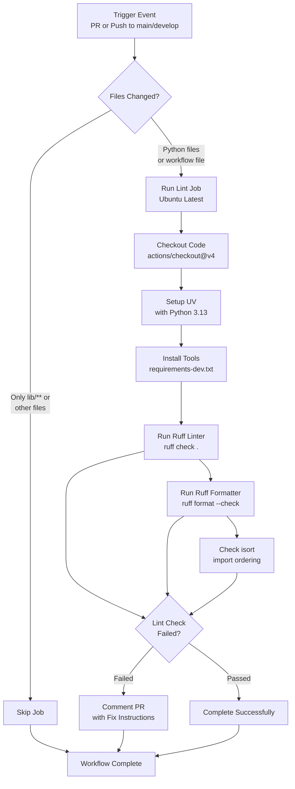

# Code Quality Workflow Documentation

## Table of Contents
1. [Overview](#overview)
2. [Workflow Diagram](#workflow-diagram)
3. [Trigger Events](#trigger-events)
4. [Job Details](#job-details)
5. [Linting Tools](#linting-tools)
6. [Configuration](#configuration)
7. [Error Handling](#error-handling)
8. [GitHub Integration](#github-integration)
9. [Best Practices](#best-practices)
10. [Troubleshooting](#troubleshooting)

---

## Overview

The **Code Quality Workflow** (`code-quality.yml`) is a GitHub Actions automation that runs code quality checks on every pull request and push to main/develop branches. It ensures consistent code style, proper import organization, and adherence to project standards.

### Purpose

- **Enforce Code Standards**: Maintains consistent code style across the project
- **Catch Issues Early**: Identifies formatting and linting problems before merge
- **Improve Readability**: Ensures imports are properly organized
- **Automate Feedback**: Provides PR comments with actionable fix instructions
- **Development Efficiency**: Developers can quickly understand and fix issues

### Key Features

- ✅ **Multi-Tool Checking**: Ruff (linting + formatting) + isort (imports)
- ✅ **Non-Blocking**: Failures don't block merges (continued execution)
- ✅ **Automated Feedback**: PR comments with fix instructions
- ✅ **Selective Execution**: Only runs on Python files (ignores `lib/`)
- ✅ **Fast Execution**: Completes in ~2-5 seconds

---

## Workflow Diagram



---

## Trigger Events

### Pull Request Trigger

```yaml
on:
  pull_request:
    paths:
      - '**.py'
      - '.github/workflows/code-quality.yml'
      - '!lib/**'
```

**When It Runs:**
- When a pull request is opened or updated
- **Only if** the following files changed:
  - Python files (`**/*.py`) anywhere in repo except `lib/`
  - The workflow file itself (`.github/workflows/code-quality.yml`)

**Why This Design:**
- Avoids running on irrelevant changes (docs, configs, etc.)
- Excludes third-party code in `lib/` directory
- Prevents unnecessary CI resource usage

**Example Scenarios:**

| Change | Triggers? | Reason |
|--------|-----------|--------|
| Modify `display_manager.py` | ✅ Yes | Python file in scope |
| Add `test_image.py` | ✅ Yes | New Python file |
| Modify `README.md` | ❌ No | Not a Python file |
| Update `lib/vendor/code.py` | ❌ No | Excluded by `!lib/**` |
| Update workflow file | ✅ Yes | Explicitly included |

---

### Push Trigger

```yaml
on:
  push:
    branches:
      - main
      - develop
    paths:
      - '**.py'
      - '!lib/**'
```

**When It Runs:**
- When code is pushed directly to `main` or `develop` branches
- Only if Python files changed (same path filtering as PR)
- Useful for catching issues in committed code

**Typical Usage:**
- Merge commits from PRs
- Direct commits to develop (during development)
- Backports or hotfixes to main

---

## Job Details

### Job Name: `lint`

```yaml
jobs:
  lint:
    runs-on: ubuntu-latest
    timeout-minutes: 5
```

| Setting | Value | Purpose |
|---------|-------|---------|
| **Runner** | `ubuntu-latest` | Standard Linux environment |
| **Timeout** | 5 minutes | Prevent stuck jobs from running indefinitely |
| **Retry Policy** | None (implicit) | Single attempt (fast fail) |

### Step Execution Order

The workflow executes the following steps sequentially:

#### Step 1: Checkout Code

```yaml
- name: Checkout code
  uses: actions/checkout@v4
```

**Purpose**: Downloads repository code into the GitHub Actions runner

**Details**:
- Uses action: `actions/checkout@v4` (latest stable version)
- Clones entire repository (shallow clone not specified)
- Creates `$GITHUB_WORKSPACE` directory with code

**Output**: Repository files available at working directory

---

#### Step 2: Setup UV

```yaml
- name: Setup UV
  id: setup-uv
  uses: astral-sh/setup-uv@v7
  with:
    python-version: '3.13'
    activate-environment: "true"
```

**Purpose**: Installs UV package manager and Python 3.13

**Details**:
- **Action**: `astral-sh/setup-uv@v7` (UV project's official action)
- **Python Version**: 3.13 (latest stable)
- **Environment Activation**: Auto-activates virtual environment
- **Step ID**: `setup-uv` (referenced later)

**Why UV?**
- Extremely fast package installation
- Built-in virtual environment management
- Better reproducibility than pip alone
- Modern Python tooling standard

**Output Variables**:
```bash
${{ steps.setup-uv.outputs.venv }}  # Virtual environment path
# Example: /home/runner/.venv
```

---

#### Step 3: Install Linting Tools

```yaml
- name: Install linting tools
  run: |
    source ${{ steps.setup-uv.outputs.venv }}/bin/activate
    uv pip install -r requirements-dev.txt
```

**Purpose**: Installs development dependencies (linting tools)

**Details**:
1. Activates UV virtual environment
2. Uses `uv pip install` (faster than standard pip)
3. Installs from `requirements-dev.txt`

**Expected Tools Installed** (from requirements-dev.txt):
- **Ruff**: Python linter and formatter
- **isort**: Import statement organizer
- **pytest**: Test runner (for coverage workflow)
- **coverage**: Test coverage measurement

**Speed**: Usually completes in 30-60 seconds (cached dependencies)

---

#### Step 4: Run Ruff Linter

```yaml
- name: Run Ruff linter
  run: |
    ruff check . --config pyproject.toml --exclude lib
  continue-on-error: true
```

**Purpose**: Checks code for linting issues (bugs, style, potential problems)

**Details**:
- **Command**: `ruff check .`
- **Scope**: Current directory (entire repo)
- **Config**: Uses `pyproject.toml` for rules
- **Exclusion**: Ignores `lib/` directory
- **Behavior**: Continues even if failed (`continue-on-error: true`)

**What Ruff Checks**:
- Unused imports and variables
- Undefined names and references
- Type annotation issues
- Common Python antipatterns
- PEP 8 style violations
- Security issues (via specific rules)

**Example Issues Detected**:
```python
# Unused import
import os  # ❌ Flagged by Ruff

# Undefined variable
print(undefined_var)  # ❌ Flagged

# Unused variable
def func():
    x = 5  # ❌ Flagged if not used
    return 10

# Trailing whitespace
name = "Bob"    # ❌ Flagged (extra spaces)
```

**Exit Code Behavior**:
- Normally: Non-zero exit on errors
- With `continue-on-error: true`: Always succeeds (errors noted for later)

---

#### Step 5: Run Ruff Formatter Check

```yaml
- name: Run Ruff formatter check
  run: |
    ruff format . --check --config pyproject.toml --exclude lib
  continue-on-error: true
```

**Purpose**: Checks if code matches the formatting standard (without modifying)

**Details**:
- **Command**: `ruff format . --check`
- **Mode**: Check-only (no modifications)
- **Config**: Uses `pyproject.toml` for style rules
- **Exclusion**: Ignores `lib/` directory
- **Behavior**: Continues on error

**What Ruff Formatter Checks**:
- Line length violations
- Indentation consistency
- Whitespace formatting
- Quote style (single vs. double)
- Blank line spacing
- Operator spacing
- Import statement formatting

**Example Issues Detected**:
```python
# Line too long
x = very_long_function_name(arg1, arg2, arg3, arg4, arg5, arg6, arg7, arg8)  # ❌

# Inconsistent indentation
def func():
  x = 1  # 2 spaces
    y = 2  # 4 spaces (mixed)

# Inconsistent quotes
name = 'Alice'  # ❌ Single quotes
other = "Bob"   # ✅ Double quotes (inconsistent)
```

---

#### Step 6: Check Import Sorting with isort

```yaml
- name: Check import sorting with isort
  run: |
    isort . --check-only --diff --skip-gitignore --ignore-whitespace --dont-follow-links --skip-glob "**/lib/*"
  continue-on-error: true
```

**Purpose**: Verifies imports are organized according to PEP 8 conventions

**Details**:
- **Tool**: `isort` (import sorting utility)
- **Mode**: `--check-only` (no modifications)
- **Output**: `--diff` (show what would change)
- **Gitignore**: Skip files in `.gitignore`
- **Whitespace**: Ignore whitespace differences
- **Symlinks**: Don't follow symbolic links
- **Exclusion**: Skip entire `lib/` directory

**Import Organization** (isort standard):
```python
# Order 1: Standard library
import os
import sys
from typing import List

# Order 2: Third-party packages
import numpy as np
import pandas as pd

# Order 3: Local application imports
from display_manager import DisplayManager
from image_converter import ImageConverter
```

**Example Issues Detected**:
```python
# ❌ Wrong order (numpy after local imports)
from display_manager import DisplayManager
import numpy as np

# ✅ Correct order
import numpy as np
from display_manager import DisplayManager

# ❌ Multiple imports on one line (with isort settings)
from module import func1, func2, func3

# ✅ Proper formatting
from module import (
    func1,
    func2,
    func3,
)
```

---

#### Step 7: Comment on PR with Lint Issues

```yaml
- name: Comment on PR with lint issues (if any)
  if: failure() && github.event_name == 'pull_request'
  uses: actions/github-script@v7
  with:
    script: |
      github.rest.issues.createComment({
        issue_number: context.issue.number,
        owner: context.repo.owner,
        repo: context.repo.repo,
        body: '⚠️ **Code Quality Issues Detected**\n\nPlease run the following to fix formatting:\n```bash\nruff check . --fix\nruff format .\nisort .\n```'
      });
```

**Purpose**: Posts a GitHub comment on the PR if linting failed

**Conditions**:
- `if: failure()` - Only runs if previous steps failed
- `&& github.event_name == 'pull_request'` - Only on PRs (not pushes)

**What the Comment Says**:

```
⚠️ Code Quality Issues Detected

Please run the following to fix formatting:
ruff check . --fix
ruff format .
isort .
```

**User Experience**:
1. Developer creates/updates PR
2. Code Quality workflow runs
3. If issues found, comment appears on PR
4. Developer sees actionable fix instructions
5. Developer runs commands locally
6. Developer commits fixed code
7. Workflow re-runs and passes

---

## Linting Tools

### Ruff

**What It Is**: A fast Python linter and formatter written in Rust

**Installation**:
```bash
pip install ruff
```

**Two Modes**:

1. **Linting** (`ruff check`)
   - Finds bugs and style violations
   - Does NOT modify code
   - Returns exit code 1 if issues found

2. **Formatting** (`ruff format`)
   - Auto-fixes code style
   - MODIFIES files (destructive)
   - Can be checked without modifying (`--check`)

**Configuration** (in `pyproject.toml`):
```toml
[tool.ruff]
line-length = 88
exclude = ["lib", "__pycache__"]

[tool.ruff.lint]
select = ["E", "F", "W"]  # Error, pyFlakes, Warning codes
```

**Common Rules**:
- `E`: PEP 8 errors (whitespace, indentation)
- `F`: PyFlakes (undefined variables, unused imports)
- `W`: Warning-level issues
- `C`: Complexity issues
- `D`: Documentation (docstring) issues
- `I`: Import ordering issues

**Running Locally**:
```bash
# Check for issues
ruff check .

# Auto-fix issues
ruff check . --fix

# Check formatting
ruff format . --check

# Auto-format code
ruff format .
```

---

### isort

**What It Is**: Utility to sort and organize import statements according to PEP 8

**Installation**:
```bash
pip install isort
```

**Purpose**: Organizes imports into standard groups (stdlib, third-party, local)

**Configuration** (in `pyproject.toml`):
```toml
[tool.isort]
profile = "black"  # Compatible with Ruff formatter
line_length = 88
```

**Import Groups**:
```python
# Group 1: Standard Library
import os
import sys
from typing import List, Optional

# Group 2: Third-party Libraries
import numpy
import requests

# Group 3: Local Application
from display_manager import DisplayManager
from .utils import helper_func
```

**Running Locally**:
```bash
# Check import order
isort . --check-only --diff

# Fix import order (modifies files)
isort .
```

---

## Configuration

### pyproject.toml Settings

The workflow uses configuration from `pyproject.toml`:

```toml
[tool.ruff]
line-length = 88
target-version = "py311"  # Minimum Python version

[tool.ruff.lint]
select = ["E", "F", "W", "I"]  # Rules to enforce
ignore = ["E501"]  # Rules to ignore

[tool.isort]
profile = "black"  # Use Black-compatible settings
line_length = 88
```

### Excluding lib/ Directory

Multiple tools exclude the `lib/` directory (third-party code):

| Tool | Exclusion Method |
|------|------------------|
| Ruff check | `--exclude lib` |
| Ruff format | `--exclude lib` |
| isort | `--skip-glob "**/lib/*"` |

**Reason**: Third-party vendored code shouldn't follow project standards

---

## Error Handling

### Continue-on-Error Strategy

All three linting steps use `continue-on-error: true`:

```yaml
- name: Run Ruff linter
  run: ruff check . --config pyproject.toml --exclude lib
  continue-on-error: true  # ← Doesn't stop on failure
```

**Purpose**:
- All tools run to completion even if one fails
- Shows developers all issues at once
- Doesn't require fixing one issue to see others

**Flow**:
```
Step 1: Ruff Linter → Error → Continue
         ↓
Step 2: Ruff Formatter → Error → Continue
         ↓
Step 3: isort → Error → Continue
         ↓
Step 4: Comment PR with all issues
```

**Alternative Strategy** (not used):
```yaml
# This would fail on first error
continue-on-error: false
```

### Failure Condition

The job is considered failed if **any** step fails:
- Checked by `if: failure()` condition in the comment step
- Comment only posts if job failed

**Note**: `continue-on-error: true` doesn't change the overall job result—just allows subsequent steps to run.

---

## GitHub Integration

### Comment on Pull Request

When linting fails on a PR, GitHub automatically posts a comment:

**Comment Details**:
- **Visibility**: Visible to all PR reviewers
- **Location**: PR conversation thread
- **Content**: Instructions for fixing issues
- **Updates**: New comment added for each failure

**Example PR Comment Screenshot**:
```
⚠️ Code Quality Issues Detected

Please run the following to fix formatting:
```bash
ruff check . --fix
ruff format .
isort .
```
```

**Developer Workflow**:
1. Make changes to code
2. Push to PR branch
3. See workflow comment with issues
4. Run fix commands locally
5. Commit fixed code
6. Workflow re-runs automatically
7. If fixed: Comment doesn't appear, PR green ✅
8. If not fixed: New comment appears, still red ❌

---

## Best Practices

### Local Development Workflow

**Before Pushing Code**:
```bash
# Run all quality checks locally
ruff check . --fix      # Auto-fix where possible
ruff format .           # Format code
isort .                 # Sort imports

# Verify everything passes
ruff check .            # Should have no output
ruff format . --check   # Should succeed
isort . --check-only    # Should succeed

# Then commit and push
git add .
git commit -m "feat: add new feature"
git push
```

**Time Savings**:
- Running locally: ~2-3 seconds
- Waiting for GitHub Actions: ~5-10 seconds
- Fixing after feedback: saves round-trip time

---

### Setting Up Pre-commit Hook

Automatically run quality checks before each commit:

**Install pre-commit framework**:
```bash
pip install pre-commit
```

**Create `.pre-commit-config.yaml`**:
```yaml
repos:
  - repo: https://github.com/astral-sh/ruff-pre-commit
    rev: v0.1.0
    hooks:
      - id: ruff
        args: ['--fix']
      - id: ruff-format

  - repo: https://github.com/PyCQA/isort
    rev: 5.12.0
    hooks:
      - id: isort
        args: ['--profile', 'black']
```

**Setup**:
```bash
pre-commit install
```

**Result**:
- Checks run automatically before each commit
- Prevents pushing code with quality issues
- Forces local fixes before PR submission

---

### Handling Noisy Failures

**Issue**: Too many linting issues in large codebases

**Solution 1: Gradually Enforce**
```yaml
# Be lenient initially, then tighten over time
select = ["E", "F"]  # Start with just errors/flakes
# Later: ["E", "F", "W"]  # Add warnings
# Later: ["E", "F", "W", "C"]  # Add complexity
```

**Solution 2: Exclude Specific Rules**
```toml
[tool.ruff.lint]
ignore = [
  "E501",  # Line too long (can use formatter)
  "E203",  # Whitespace before ':'
  "W291",  # Trailing whitespace
]
```

**Solution 3: Auto-fix Before Merge**
```bash
# Run before merging PRs
ruff check . --fix
ruff format .
isort .
git add .
git commit -m "style: apply code quality fixes"
```

---

## Troubleshooting

### Issue: Workflow Doesn't Run

**Symptom**: You made Python changes but workflow didn't trigger

**Possible Causes**:

1. **Only `lib/` directory changed**
   - Path filter excludes `lib/**`
   - Workflow intentionally skipped

2. **Wrong branch pushed to**
   - Workflow only triggers on `main` or `develop`
   - Push to feature branch: only triggers on PR creation

3. **PR not created yet**
   - On PR trigger: Creates PR, then workflow runs
   - May take 30 seconds to appear

**Solution**:
```bash
# Force workflow rerun in GitHub UI
# Or push a new commit to trigger
git commit --allow-empty -m "Trigger workflow"
git push
```

---

### Issue: Comment Not Appearing

**Symptom**: Linting failed but no comment on PR

**Possible Causes**:

1. **Workflow failed on push (not PR)**
   - Comment step only runs on PRs
   - Push to main/develop doesn't create comments

2. **Different error occurred**
   - If workflow crashes, comment step skipped
   - Check "Actions" tab for error logs

**Debugging**:
```bash
# Check workflow execution logs
# Go to: GitHub UI → Actions tab → Code Quality Checks
# Click the failed run to see details
```

---

### Issue: Tools Disagree

**Symptom**: One tool passes but another fails

**Possible Causes**:

1. **Ruff formatter vs isort conflict**
   - Different wrapping preferences
   - Solution: isort uses "black" profile for compatibility

2. **Different Python versions**
   - Workflow uses Python 3.13
   - Local dev using Python 3.11
   - Different behavior in edge cases

**Solution**:
```bash
# Use exact same Python version as workflow
python3.13 -m venv venv
source venv/bin/activate

# Or use pyenv to manage versions
pyenv local 3.13.0
```

---

### Issue: "Coverage below threshold" on code-quality workflow

**This shouldn't appear in code-quality.yml** (it's in pytest-coverage.yml)

**If you see coverage messages**:
- Check that you're looking at the right workflow
- code-quality.yml: Only runs linting
- pytest-coverage.yml: Tests and coverage

---

## Integration with Merge Protection

You can require this workflow to pass before merging:

**In GitHub Repository Settings**:
1. Go to Settings → Branches
2. Add branch protection rule for `main`
3. Require status checks to pass before merging
4. Select "Code Quality Checks"

**Effect**:
- PRs can't merge until workflow passes
- Ensures all code meets quality standards
- Can enforce strictly or allow admins to override

---

## Performance Optimization

### Current Performance
- **Checkout**: ~2 seconds
- **Setup UV**: ~3 seconds
- **Install dependencies**: ~15-30 seconds (cached)
- **Ruff linting**: ~2 seconds
- **Ruff formatting**: ~2 seconds
- **isort**: ~1 second
- **Comment**: <1 second

**Total**: ~25-40 seconds

### Cache Strategy

GitHub Actions caches pip dependencies:
```yaml
- uses: actions/setup-python@v4
  with:
    cache: 'pip'  # ← Caches pip cache directory
```

**First Run**: ~40 seconds
**Subsequent Runs**: ~25 seconds (faster with cache)

### Speeding Up Further

If timing becomes problematic:

1. **Split workflows**:
```yaml
# code-quality-ruff.yml
# code-quality-isort.yml
# Runs in parallel if possible
```

2. **Use matrix strategy**:
```yaml
strategy:
  matrix:
    tool: [ruff, isort]
```

3. **Increase timeout if needed**:
```yaml
timeout-minutes: 10  # From current 5
```

---

## Summary

| Aspect | Details |
|--------|---------|
| **Purpose** | Enforce code quality standards |
| **Triggers** | PR + push to main/develop on Python changes |
| **Tools** | Ruff (lint + format) + isort (imports) |
| **Speed** | 25-40 seconds |
| **Cost** | Minimal (GitHub Actions free tier) |
| **Failure Effect** | Non-blocking (doesn't prevent merge) |
| **Feedback** | Automated PR comments with fixes |

