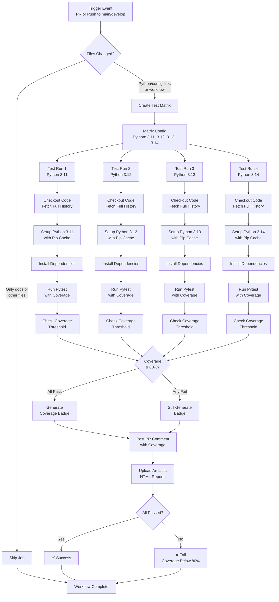
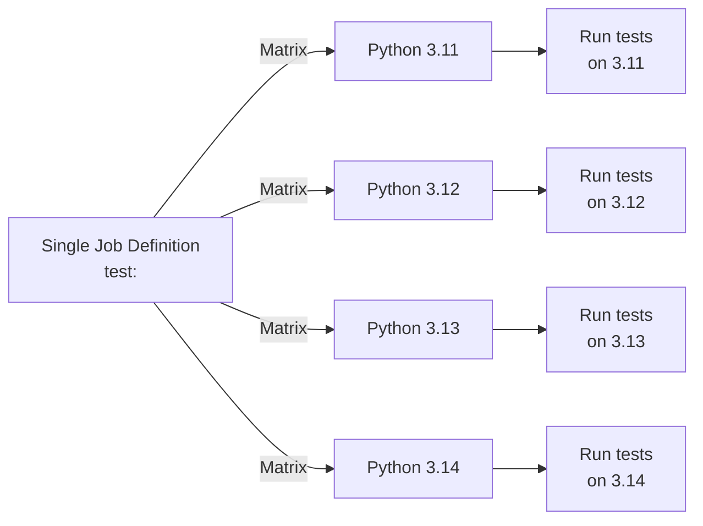

# Python Tests & Coverage Workflow Documentation

## Table of Contents
1. [Overview](#overview)
2. [Workflow Diagram](#workflow-diagram)
3. [Trigger Events](#trigger-events)
4. [Job Configuration](#job-configuration)
5. [Matrix Testing Strategy](#matrix-testing-strategy)
6. [Test Execution](#test-execution)
7. [Coverage Measurement](#coverage-measurement)
8. [GitHub Integration](#github-integration)
9. [Artifact Management](#artifact-management)
10. [Troubleshooting](#troubleshooting)

---

## Overview

The **Python Tests & Coverage Workflow** (`pytest-coverage.yml`) is a comprehensive GitHub Actions automation that runs tests across multiple Python versions and measures code coverage. It ensures code quality, functionality verification, and documentation of test coverage metrics.

### Purpose

- **Multi-Version Testing**: Verify code works on Python 3.11, 3.12, 3.13, and 3.14
- **Continuous Verification**: Run tests on every PR and push to main/develop
- **Coverage Enforcement**: Ensure test coverage meets minimum threshold (80%)
- **Automated Reporting**: Post coverage metrics on PRs for visibility
- **Artifact Storage**: Archive coverage reports for historical tracking

### Key Features

- ✅ **Matrix Testing**: Runs tests on 4 Python versions in parallel
- ✅ **Coverage Threshold**: Enforces 80% code coverage minimum
- ✅ **PR Comments**: Automatically posts coverage summary to PRs
- ✅ **Artifact Retention**: Stores coverage reports for 30 days
- ✅ **HTML Reports**: Generates detailed coverage visualizations
- ✅ **Fast Feedback**: ~1-2 minutes for complete test suite

---

## Workflow Diagram



This diagram shows the parallel matrix testing execution and coverage check flow.

---

## Trigger Events

### Pull Request Trigger

```yaml
on:
  pull_request:
    paths:
      - '**.py'
      - 'requirements*.txt'
      - 'pyproject.toml'
      - '.github/workflows/pytest-coverage.yml'
      - '!lib/**'
```

**When It Runs:**
- On PR creation or update
- **Only if** these files changed:
  - Python files (`**/*.py`) except `lib/`
  - Requirements files (`requirements*.txt`)
  - Project config (`pyproject.toml`)
  - This workflow file

**Why This Design:**
- Testing only needed if code/dependencies change
- Skips unnecessary runs on doc/comment updates
- Excludes third-party code in `lib/`

**Example Scenarios:**

| Change | Triggers? | Reason |
|--------|-----------|--------|
| Add `test_display.py` | ✅ Yes | Python file changed |
| Update `requirements.txt` | ✅ Yes | Dependencies changed |
| Modify `pyproject.toml` | ✅ Yes | Config changed |
| Update `README.md` | ❌ No | No code changed |
| Modify `lib/vendor/lib.py` | ❌ No | Excluded by filter |

---

### Push Trigger

```yaml
on:
  push:
    branches:
      - main
      - develop
    paths:
      - '**.py'
      - 'requirements*.txt'
      - 'pyproject.toml'
      - '!lib/**'
```

**When It Runs:**
- On direct push to `main` or `develop` branches
- Same path filtering as PR trigger
- Useful for catching issues in merged code

**Typical Use Cases:**
- Merge commits from PRs
- Hotfixes directly to main
- Development commits to develop

---

## Job Configuration

### Job Name: `test`

```yaml
jobs:
  test:
    runs-on: ubuntu-latest
    timeout-minutes: 10

    strategy:
      matrix:
        python-version: ['3.11', '3.12', '3.13', '3.14']
      fail-fast: false
```

| Setting | Value | Purpose |
|---------|-------|---------|
| **Runner** | `ubuntu-latest` | Standard Linux environment |
| **Timeout** | 10 minutes | Prevent stuck jobs |
| **Strategy** | Matrix with 4 versions | Test multiple Python versions |
| **Fail-Fast** | `false` | Run all versions even if one fails |

### Fail-Fast Behavior

**With `fail-fast: false`** (current):
```
Python 3.11: Test and measure coverage
Python 3.12: Test and measure coverage
Python 3.13: Test and measure coverage
Python 3.14: Test and measure coverage

All complete, then evaluate results
Report all failures at once
```

**With `fail-fast: true`** (if changed):
```
Python 3.11: ❌ Fails
Python 3.12: Cancelled (not run)
Python 3.13: Cancelled (not run)
Python 3.14: Cancelled (not run)

Stop immediately on first failure
```

**Current choice (`fail-fast: false`)** is better because:
- Shows results across all versions
- Identifies version-specific issues
- Developers see complete picture

---

## Matrix Testing Strategy

### What Is Matrix Testing?

Matrix testing runs the same job with different parameter combinations:



**Execution Timeline**:
```
t=0s:   All 4 jobs start simultaneously
t=30s:  All 4 jobs complete (in parallel)

vs. Sequential (if not parallel):
t=0s:   Python 3.11 starts
t=30s:  Python 3.11 completes, Python 3.12 starts
t=60s:  Python 3.12 completes, Python 3.13 starts
t=90s:  Python 3.13 completes, Python 3.14 starts
t=120s: Python 3.14 completes
```

### Python Versions Tested

| Version | Status | Purpose |
|---------|--------|---------|
| **3.11** | Older stable | Compatibility check |
| **3.12** | Stable | Current mainstream |
| **3.13** | Recent | Bleeding edge |
| **3.14** | Future beta | Early adoption testing |

**Why Multiple Versions?**

1. **Library Compatibility**: Some packages work on specific versions only
2. **Feature Support**: Python features vary by version
3. **Deprecation Warnings**: Track Python deprecations early
4. **User Diversity**: Users run different Python versions
5. **Forward Compatibility**: Prepare for future versions

**Coverage for Each Version**:
- Each version runs full test suite independently
- Coverage measured separately for each version
- Must meet 80% threshold on **each version**

---

## Test Execution

### Step-by-Step Breakdown

#### Step 1: Checkout Code

```yaml
- name: Checkout code
  uses: actions/checkout@v4
  with:
    fetch-depth: 0  # Full history
```

**Purpose**: Download repository code

**Details**:
- `fetch-depth: 0`: Fetches entire git history (not shallow)
- **Why**: Allows proper diff calculation for coverage reports
- Creates working directory with all code

**File State**: Repository files available at runner workspace

---

#### Step 2: Set Up Python

```yaml
- name: Set up Python ${{ matrix.python-version }}
  uses: actions/setup-python@v4
  with:
    python-version: ${{ matrix.python-version }}
    cache: 'pip'
```

**Purpose**: Install specified Python version

**Details**:
- **Action**: `actions/setup-python@v4` (official GitHub action)
- **Version**: `${{ matrix.python-version }}` (e.g., "3.11", "3.12")
- **Cache**: `pip` (caches pip package cache directory)

**How Matrix Variable Works**:
```yaml
matrix:
  python-version: ['3.11', '3.12', '3.13', '3.14']

# First iteration: ${{ matrix.python-version }} = '3.11'
# Second iteration: ${{ matrix.python-version }} = '3.12'
# etc.
```

**Cache Behavior**:
- **First Run**: Downloads packages, stores in cache
- **Subsequent Runs**: Restores from cache (faster)
- **Cache Key**: Includes Python version and requirements files
- **Speed Improvement**: 2-3 minutes → 30-60 seconds

---

#### Step 3: Install Dependencies

```yaml
- name: Install dependencies
  run: |
    python -m pip install --upgrade pip
    pip install -r requirements-dev.txt
```

**Purpose**: Install project dependencies and testing tools

**Details**:
1. Upgrade pip to latest version
2. Install from `requirements-dev.txt` (includes pytest, coverage, etc.)

**What Gets Installed**:
- **pytest**: Test runner
- **pytest-cov**: Coverage plugin for pytest
- **coverage**: Coverage measurement tool
- **project dependencies**: Listed in requirements files

**Output**: Python environment ready to run tests

---

#### Step 4: Run Pytest with Coverage

```yaml
- name: Run pytest with coverage
  run: |
    pytest tests/ \
      --cov=. \
      --cov-report=term-missing \
      --cov-report=xml \
      --cov-report=html \
      --ignore=lib \
      -v
```

**Purpose**: Execute tests and measure code coverage

**Parameters Breakdown**:

| Parameter | Purpose |
|-----------|---------|
| `tests/` | Directory containing test files |
| `--cov=.` | Measure coverage for all code (current dir) |
| `--cov-report=term-missing` | Print coverage report to terminal (show missing lines) |
| `--cov-report=xml` | Generate XML report (`coverage.xml`) |
| `--cov-report=html` | Generate HTML report (`htmlcov/` directory) |
| `--ignore=lib` | Exclude `lib/` from coverage measurement |
| `-v` | Verbose output (show each test) |

**Test Discovery**:
- Pytest searches `tests/` directory
- Finds files matching `test_*.py` or `*_test.py`
- Runs functions named `test_*`

**Output Files**:
```
coverage.xml      # XML format for programmatic parsing
htmlcov/          # HTML report directory
  └── index.html  # Main coverage report page
```

**Example Output**:
```
tests/test_image_converter.py::test_resize_image PASSED
tests/test_display_manager.py::test_fetch_images PASSED
tests/test_frame_manager.py::test_main FAILED

Name                      Stmts   Miss  Cover   Missing
─────────────────────────────────────────────────────
display_manager.py          100    10   90%     145-150
frame_manager.py             45     2   95%     78
image_converter.py           85     5   94%     120-125
─────────────────────────────────────────────────────
TOTAL                       230    17   92%

Coverage: 92%
```

---

#### Step 5: Check Coverage Threshold

```yaml
- name: Check coverage threshold
  run: |
    python -m coverage report --fail-under=80
  continue-on-error: false
```

**Purpose**: Verify coverage meets minimum requirement

**Details**:
- **Threshold**: 80% (configurable)
- **Exit Code**: Non-zero if below threshold
- **Behavior**: `continue-on-error: false` means failure stops workflow

**How It Works**:
```bash
# Reads coverage.xml from previous step
# Calculates total coverage percentage
# Compares to threshold (80%)

if coverage >= 80:
    echo "✅ Coverage meets threshold"
    exit 0  # Success

else:
    echo "❌ Coverage below threshold"
    exit 1  # Failure - stops job
```

**Example Scenarios**:

| Coverage | Threshold | Result |
|----------|-----------|--------|
| 85% | 80% | ✅ Pass |
| 80% | 80% | ✅ Pass (equal) |
| 79% | 80% | ❌ Fail |
| 50% | 80% | ❌ Fail |

---

#### Step 6: Generate Coverage Badge

```yaml
- name: Generate coverage badge
  if: always()
  run: |
    python -c "
    import xml.etree.ElementTree as ET
    tree = ET.parse('coverage.xml')
    root = tree.getroot()
    coverage_pct = float(root.get('line-rate', 0)) * 100
    print(f'Coverage: {coverage_pct:.1f}%')
    "
```

**Purpose**: Extract coverage percentage from XML for PR comment

**Details**:
- `if: always()`: Run even if tests failed
- Parses `coverage.xml` (XML format)
- Extracts `line-rate` attribute (decimal, 0-1)
- Converts to percentage (multiply by 100)
- Prints for use in next step

**XML Structure**:
```xml
<?xml version="1.0" ?>
<coverage version="7.0" line-rate="0.925" branch-rate="0.0">
  <!-- line-rate="0.925" means 92.5% coverage -->
  <packages>
    <package .../>
  </packages>
</coverage>
```

**Output Example**:
```
Coverage: 92.5%
```

---

#### Step 7: Comment PR with Coverage

```yaml
- name: Comment PR with coverage
  if: github.event_name == 'pull_request' && always()
  uses: actions/github-script@v7
  with:
    script: |
      const fs = require('fs');
      const { execSync } = require('child_process');

      try {
        const coverage = execSync('python -m coverage report | grep TOTAL | awk \'{print $NF}\'').toString().trim();
        const hasFailed = ${{ job.status == 'failure' }};

        let comment = `## Test Results\n\n`;
        comment += `- **Coverage:** ${coverage}\n`;
        comment += `- **Threshold:** 80%\n`;

        if (hasFailed) {
          comment += `- **Status:** ❌ Coverage below threshold\n`;
        } else {
          comment += `- **Status:** ✅ All checks passed\n`;
        }

        github.rest.issues.createComment({
          issue_number: context.issue.number,
          owner: context.repo.owner,
          repo: context.repo.repo,
          body: comment
        });
      } catch (error) {
        console.log('Could not parse coverage');
      }
```

**Purpose**: Post coverage summary comment on PR

**Conditions**:
- `if: github.event_name == 'pull_request'`: Only on PRs
- `&& always()`: Run even if tests failed

**What the Comment Shows**:
```
## Test Results

- **Coverage:** 92%
- **Threshold:** 80%
- **Status:** ✅ All checks passed
```

**or** (if failed):
```
## Test Results

- **Coverage:** 75%
- **Threshold:** 80%
- **Status:** ❌ Coverage below threshold
```

**User Experience**:
1. Developer creates PR
2. Tests run and measure coverage
3. Comment appears on PR automatically
4. Developer sees coverage metrics at a glance
5. Can review HTML report for details

---

#### Step 8: Upload Coverage Artifacts

```yaml
- name: Upload coverage artifacts
  if: always()
  uses: actions/upload-artifact@v4
  with:
    name: coverage-report-py${{ matrix.python-version }}
    path: |
      htmlcov/
      coverage.xml
    retention-days: 30
```

**Purpose**: Archive coverage reports for download and historical tracking

**Details**:
- **Artifact Name**: `coverage-report-py3.11`, `coverage-report-py3.12`, etc.
- **Contents**: HTML report + XML report
- **Retention**: 30 days (GitHub Actions default limit)

**What Gets Uploaded**:
```
htmlcov/
  ├── index.html          # Main report page
  ├── status.json         # Coverage data
  ├── display_manager.html
  ├── frame_manager.html
  ├── image_converter.html
  └── sd_monitor.html

coverage.xml              # Machine-readable coverage
```

**Downloading Artifacts**:
```
GitHub UI → Actions → Test Run → Artifacts
→ Download "coverage-report-py3.13"
→ Extract and open htmlcov/index.html in browser
```

**HTML Report Example**:
```
Name                    Stmts   Miss Branch BrExcl  Cover
──────────────────────────────────────────────────────
display_manager.py        100    10      50      0  90%
  ├── Class DisplayManager
  │   ├── __init__           10     0      0      0  100%
  │   ├── reset_frame         5     1      2      0  80%
  │   └── ...
  └── [Uncovered lines: 145-150]
```

---

#### Step 9: Fail if Coverage Insufficient

```yaml
- name: Fail if coverage insufficient
  if: always()
  run: |
    COVERAGE=$(python -m coverage report | grep TOTAL | awk '{print $NF}' | sed 's/%//')
    THRESHOLD=80

    if (( $(echo "$COVERAGE < $THRESHOLD" | bc -l) )); then
      echo "❌ Coverage is $COVERAGE%, which is below the required threshold of ${THRESHOLD}%"
      exit 1
    else
      echo "✅ Coverage is $COVERAGE%, meets the required threshold of ${THRESHOLD}%"
      fi
```

**Purpose**: Final coverage check with explicit success/failure message

**Details**:
- Extracts coverage percentage from report
- Compares to threshold (80%)
- Exits with appropriate code
- Always runs (`if: always()`) for clear messaging

**Shell Commands**:
- `grep TOTAL`: Find total line
- `awk '{print $NF}'`: Extract last field (percentage)
- `sed 's/%//'`: Remove % symbol
- `bc -l`: Floating-point comparison

**Output Examples**:
```
✅ Coverage is 92%, meets the required threshold of 80%
```

or

```
❌ Coverage is 75%, which is below the required threshold of 80%
```

**Exit Code Handling**:
- Successful: `exit 0`
- Failed: `exit 1` (causes job to fail)

---

## Coverage Measurement

### What Is Code Coverage?

Code coverage measures what percentage of your code is executed by tests.

```python
# Example function
def greet(name):
    if name:
        return f"Hello, {name}!"
    else:
        return "Hello, stranger!"

# Test
def test_greet_with_name():
    assert greet("Alice") == "Hello, Alice!"

# Coverage analysis:
# Line 3: Executed (50% of if-else)
# Line 4: Executed
# Line 5: Not executed (missing test for empty name)
# Line 6: Executed
# Overall: 83% (5 out of 6 lines)
```

### Line Coverage vs Branch Coverage

**Line Coverage**:
- Did the code line execute?
- Simpler metric
- What this workflow measures

**Branch Coverage**:
- Did all code branches execute?
- If/else, try/except, etc.
- More comprehensive but complex

**Example**:
```python
if x > 10:           # Branch 1
    print("High")   # Line covered
else:                # Branch 2
    print("Low")    # Line NOT covered
```

- **Line Coverage**: 67% (2 of 3 lines executed)
- **Branch Coverage**: 50% (1 of 2 branches executed)

### Coverage Target: 80%

**Why 80%?**
- High enough to catch major gaps
- Low enough to be achievable
- Industry standard for quality projects
- Allows for edge cases and error paths

**Coverage by Tier**:
- **< 50%**: Poor (testing gaps)
- **50-70%**: Fair (basic coverage)
- **70-80%**: Good (solid foundation)
- **80-95%**: Excellent (thorough testing)
- **95-100%**: Rare (testing trivial code)

### Common Coverage Gaps

**Excluded from Tests** (intentional):
```python
if __name__ == "__main__":  # Excluded (main guard)
    main()

try:
    risky_operation()
except HardwareNotAvailable:  # Hard to test
    handle_gracefully()
```

**Not Tested** (should be):
```python
def calculate(x):
    if x < 0:           # ← Not tested path
        return x * -1
    return x
```

---

## GitHub Integration

### PR Comment Display

When tests complete, a comment appears on the PR:

```
## Test Results

- **Coverage:** 92%
- **Threshold:** 80%
- **Status:** ✅ All checks passed
```

**Visible to**: All PR reviewers

**Information**: Quick coverage metrics at a glance

### Artifact Download

Test artifacts are available for download:

**In GitHub UI**:
1. Go to PR → "Checks" tab
2. Click "Tests and Coverage"
3. Scroll to "Artifacts"
4. Download coverage report

**Contents**:
- HTML coverage report (viewable in browser)
- XML coverage report (for programmatic use)

### Test Result Display

GitHub shows test results in the Checks section:

- ✅ **Passed**: All tests passed, coverage ≥ 80%
- ❌ **Failed**: Tests failed or coverage < 80%
- ⚠️ **Coverage**: Each Python version has own report

---

## Artifact Management

### Artifact Lifecycle

```
Tests Complete
    ↓
Generate htmlcov/ and coverage.xml
    ↓
Upload artifacts (30-day retention)
    ↓
30 days pass
    ↓
GitHub automatically deletes artifacts
```

### Retention Policy

**Current Setting**: 30 days

**Calculation**:
- Run Date: October 26, 2024
- Expiration: November 25, 2024
- Deleted: Automatically by GitHub

**To Keep Longer**:
```yaml
retention-days: 90   # Keep for 90 days
# or
retention-days: 365  # Keep for 1 year
```

### Accessing Reports

**Option 1: GitHub UI** (easiest)
```
1. Go to Actions tab
2. Click test run
3. Scroll to Artifacts section
4. Download "coverage-report-py3.13"
5. Extract zip
6. Open htmlcov/index.html
```

**Option 2: Command Line** (if using GitHub CLI)
```bash
# List artifacts
gh run list --repo owner/repo

# Download specific artifact
gh run download <run-id> --repo owner/repo --name coverage-report-py3.13

# Extract and view
unzip coverage-report-py3.13.zip
open htmlcov/index.html
```

---

## Performance Characteristics

### Execution Timeline

```
t=0s:    Workflow starts
t=30s:   All 4 Python versions checkout and setup
t=60s:   Dependencies installed (from cache)
t=90s:   Tests running on all 4 versions in parallel
t=120s:  Tests complete, coverage calculated
t=150s:  Artifacts uploaded
t=160s:  Workflow complete

Total: ~2-3 minutes
```

**Actual time depends on**:
- Cache hits (reduces install time by 1-2 minutes)
- Number of tests (scales linearly)
- Test complexity (CPU-bound tests slower)

### Parallel Execution

```
Sequential (4 jobs one after another):
Job 1 (Py 3.11): ▓▓▓▓▓ 30s
Job 2 (Py 3.12): ▓▓▓▓▓ 30s
Job 3 (Py 3.13): ▓▓▓▓▓ 30s
Job 4 (Py 3.14): ▓▓▓▓▓ 30s
Total: 120s

Parallel (4 jobs simultaneously):
Job 1 (Py 3.11): ▓▓▓▓▓ 30s
Job 2 (Py 3.12): ▓▓▓▓▓ 30s
Job 3 (Py 3.13): ▓▓▓▓▓ 30s
Job 4 (Py 3.14): ▓▓▓▓▓ 30s
Total: 30s (all at once)
```

**Current: Parallel** (much faster)

### Resource Usage

**Per Job**:
- **CPU**: ~2-4 cores (GitHub's standard runner)
- **Memory**: ~2-4 GB (tests + coverage)
- **Disk**: ~500MB-1GB (virtual environment + reports)

**Total Cost**:
- **Free Tier**: 2,000 free minutes/month per account
- **This Workflow**: ~3 minutes per run
- **Monthly**: ~100+ runs possible on free tier

---

## Troubleshooting

### Issue: Coverage Below Threshold

**Symptom**: Tests pass but coverage fails

**Possible Causes**:
1. New code without tests
2. Untested error paths
3. Ignored test files

**Debug**:
```bash
# View detailed coverage report
pytest tests/ --cov=. --cov-report=term-missing

# See which lines aren't covered
# In output, "Missing" column shows uncovered lines
```

**Solution**:
```python
# Add tests for uncovered lines
def test_error_case():
    with pytest.raises(ValueError):
        function_that_might_error("bad input")
```

---

### Issue: Tests Pass Locally But Fail in CI

**Symptom**: Tests work on local machine but fail in GitHub Actions

**Possible Causes**:

1. **Different Python Version**:
```bash
# Check local version
python --version

# Run tests with CI Python version
python3.13 -m pytest tests/
```

2. **Missing Dependencies**:
```bash
# Ensure dev requirements installed
pip install -r requirements-dev.txt
```

3. **Environment Variables**:
```python
# Tests may need env variables
# Set in workflow or in test fixtures
os.environ['TEST_VAR'] = 'value'
```

4. **File Paths**:
```python
# Absolute paths fail on CI
# Use relative paths from repo root
import os
test_data = os.path.join(os.path.dirname(__file__), '..', 'test_data')
```

**Solution**:
```bash
# Test with same Python version
python3.13 -m venv venv
source venv/bin/activate
pip install -r requirements-dev.txt
pytest tests/
```

---

### Issue: Artifacts Not Generated

**Symptom**: Coverage report artifacts don't appear

**Possible Causes**:
1. Tests failed catastrophically (no coverage.xml generated)
2. `htmlcov/` directory not created
3. Storage quota exceeded

**Debug**:
```bash
# Check if coverage files created
ls -la htmlcov/
ls -la coverage.xml

# If not, pytest didn't run properly
pytest tests/ --cov=. --cov-report=html
```

**Solution**:
- Fix test failures first
- Ensure pytest runs to completion
- Check disk space on runner

---

### Issue: Same Coverage on All Python Versions

**Symptom**: Coverage report identical for Py 3.11-3.14

**Note**: This is **normal** if:
- Code doesn't use version-specific features
- Tests work same on all versions
- No conditional imports based on version

**Expected Variation**:
```python
import sys

if sys.version_info >= (3, 13):
    # Python 3.13+ feature
    use_feature_a()
else:
    # Fallback for older versions
    use_feature_b()
```

In this case:
- Python 3.13/3.14: Branch A covered (>80%)
- Python 3.11/3.12: Branch B covered (>80%)
- Overall: Both branches tested, good coverage

---

### Issue: Matrix Job Cancelled

**Symptom**: Some Python versions show "Cancelled"

**Possible Causes**:
1. GitHub Actions quota exceeded
2. Runner capacity issues
3. Job failure with `fail-fast: true`

**Current Setting**: `fail-fast: false` (doesn't cancel other jobs)

**If Changed to `fail-fast: true`**:
- First failure cancels remaining jobs
- Not recommended for this workflow

---

## Best Practices

### Local Testing Before Push

```bash
# Test with exact CI environment
python3.13 -m pip install --upgrade pip
pip install -r requirements-dev.txt

# Run tests with coverage
pytest tests/ \
  --cov=. \
  --cov-report=term-missing \
  --cov-report=html

# View HTML report
open htmlcov/index.html

# Check coverage threshold
coverage report --fail-under=80
```

### Writing Testable Code

```python
# ✅ Good: Easily testable
def calculate_price(quantity: int, unit_price: float) -> float:
    return quantity * unit_price

# ❌ Bad: Hard to test (depends on external state)
def calculate_price(quantity: int) -> float:
    return quantity * GLOBAL_UNIT_PRICE  # Can't easily change
```

### Comprehensive Test Coverage

```python
# Test normal case
def test_positive_case():
    assert greet("Alice") == "Hello, Alice!"

# Test edge case
def test_empty_name():
    assert greet("") == "Hello, stranger!"

# Test error case
def test_none_name():
    with pytest.raises(TypeError):
        greet(None)
```

### Continuous Monitoring

Track coverage over time:

```bash
# Run workflow and check each time
# Ensure coverage improves or stays same
# If coverage drops, add tests before merge
```

---

## Integration with Branch Protection

You can require this workflow to pass before merging:

**Settings → Branches → Add Protection Rule**:
1. Set branch: `main`
2. Require status checks: Enable
3. Select: "Python Tests & Coverage"
4. Also require: "Code Quality Checks"

**Effect**:
- PRs can't merge until tests pass
- Can't merge if coverage < 80%
- Ensures quality on main branch

---

## Extending the Workflow

### Adding More Python Versions

```yaml
strategy:
  matrix:
    python-version: ['3.11', '3.12', '3.13', '3.14', '3.15']
```

### Adding More Test Configurations

```yaml
strategy:
  matrix:
    python-version: ['3.11', '3.12', '3.13', '3.14']
    os: [ubuntu-latest, windows-latest, macos-latest]
```

Creates 12 jobs (4 Python versions × 3 operating systems)

### Running Specific Test Suite

```yaml
- name: Run pytest
  run: |
    pytest tests/unit/  # Only unit tests
    # or
    pytest tests/ -k "display"  # Only tests matching "display"
```

---

## Summary

| Aspect | Details |
|--------|---------|
| **Purpose** | Test code on multiple Python versions and measure coverage |
| **Triggers** | PR + push to main/develop on code changes |
| **Test Versions** | Python 3.11, 3.12, 3.13, 3.14 (in parallel) |
| **Coverage Target** | 80% minimum |
| **Execution Time** | 2-3 minutes |
| **PR Feedback** | Automated coverage comment |
| **Artifacts** | HTML + XML coverage reports (30-day retention) |
| **Failure Effect** | Blocks merge (if branch protection enabled) |
| **Cost** | ~3 minutes per run on free tier |

