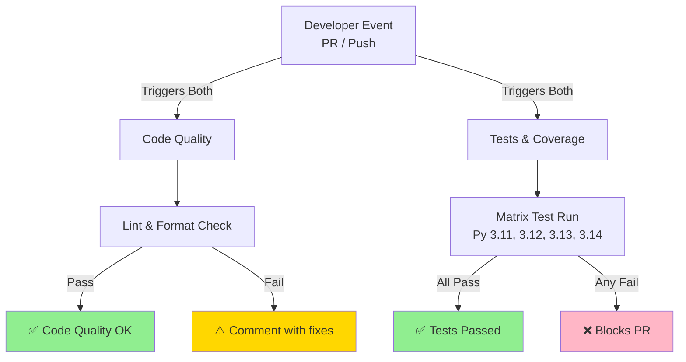

# GitHub Workflows Documentation

Complete guide to all GitHub Actions workflows in the eInkFrame project.

## Quick Navigation

| Workflow | Purpose | Files |
|----------|---------|-------|
| **Code Quality** | Enforce code standards and formatting | [code-quality.yml](code-quality.yml) · [Docs](CODE_QUALITY.md) |
| **Python Tests & Coverage** | Test on multiple Python versions | [pytest-coverage.yml](pytest-coverage.yml) · [Docs](PYTEST_COVERAGE.md) |

---

## Table of Contents
1. [Overview](#overview)
2. [Workflow Comparison](#workflow-comparison)
3. [Trigger Matrix](#trigger-matrix)
4. [Execution Timeline](#execution-timeline)
5. [Common Tasks](#common-tasks)
6. [Debugging Workflows](#debugging-workflows)
7. [Customization Guide](#customization-guide)

---

## Overview

### What Are Workflows?

GitHub Actions workflows are automated processes that run in response to repository events (PR creation, push, etc.). They execute tasks like:
- Code quality checks
- Automated testing
- Building and deploying code
- Publishing releases

### eInkFrame Workflows

The eInkFrame project has **2 active workflows**:

1. **Code Quality Checks** - Linting, formatting, import organization
2. **Python Tests & Coverage** - Comprehensive testing across Python versions

**Why Multiple Workflows?**
- Separate concerns (quality vs. testing)
- Run independently and in parallel
- Different feedback mechanisms
- Flexible trigger conditions

---

## Workflow Comparison

### Side-by-Side Comparison

```
┌─────────────────────────┬──────────────────┬────────────────────┐
│ Aspect                  │ Code Quality     │ Tests & Coverage   │
├─────────────────────────┼──────────────────┼────────────────────┤
│ Purpose                 │ Style checking   │ Functionality test │
│ Tools                   │ Ruff, isort      │ pytest, coverage   │
│ File Scope              │ All .py files    │ tests/ directory   │
│ Python Versions         │ Single (3.13)    │ Multiple (4 ver.)  │
│ Execution Time          │ ~30 seconds      │ ~2-3 minutes       │
│ Failure Impact          │ PR comment       │ Blocks merge       │
│ Parallel Jobs           │ Single job       │ 4 jobs (matrix)    │
│ PR Comment             │ Yes (on failure)  │ Yes (always)       │
│ Artifacts              │ None             │ Coverage reports   │
└─────────────────────────┴──────────────────┴────────────────────┘
```

### When Each Runs



---

## Trigger Matrix

### What Events Trigger Workflows?

Both workflows trigger on these events:

#### Pull Request Events

```yaml
on:
  pull_request:
    paths:
      - '**.py'              # Any Python file changes
      - 'requirements*.txt'  # Dependency changes
      - 'pyproject.toml'     # Config changes
      - '.github/workflows/*.yml'  # Workflow changes
      - '!lib/**'            # EXCEPT anything in lib/
```

**When It Applies**:
- Opening a new PR
- Pushing commits to PR branch
- Updating PR title/description (no code changes)

**Files That Trigger**:
```
✅ src/main.py
✅ tests/test_main.py
✅ requirements.txt
✅ .github/workflows/code-quality.yml
❌ README.md
❌ lib/vendor/third_party.py
❌ docs/api.md
```

#### Push Events

```yaml
on:
  push:
    branches:
      - main
      - develop
    paths:
      - '**.py'
      - 'requirements*.txt'
      - 'pyproject.toml'
      - '!lib/**'
```

**When It Applies**:
- Pushing directly to main/develop (unusual)
- Merging a PR (creates merge commit)
- Rebasing onto main/develop

**Typical Scenarios**:
```
Scenario 1: Merge PR to main
  GitHub: Creates merge commit
  Trigger: Push to main detected
  Action: Both workflows run

Scenario 2: Push to feature branch
  Trigger: No (branch not in trigger list)
  Action: Workflows don't run
  Note: Will run when PR created

Scenario 3: Hotfix to main
  Trigger: Push to main detected
  Action: Both workflows run
```

---

## Execution Timeline

### Parallel Execution Flow

```
t=0s:    Developer pushes code to PR
         ↓
t=5s:    GitHub detects changes
         ├─→ Code Quality workflow triggered
         └─→ Tests & Coverage workflow triggered
         ↓
t=10s:   Workflows running in parallel
         ├─ Code Quality: Checking linting
         └─ Tests & Coverage: Running 4 Python versions
         ↓
t=40s:   Code Quality completes
         ├─ All checks pass: ✅
         └─ PR status: Green checkmark
         ↓
t=200s:  Tests & Coverage complete (worst case)
         ├─ All tests pass, coverage ≥80%: ✅
         └─ PR status: Green checkmark (if code quality passed)
         ↓
t=200s:  Both workflows complete
         Both statuses green: ✅ Ready to merge
         Any status red: ❌ Fix issues first
```

### Typical Timing

| Stage | Duration | Notes |
|-------|----------|-------|
| GitHub detects push | <5s | Automatic |
| Workflows start | 5-10s | Queue time |
| Code Quality | 25-40s | Fast (single Python version) |
| Tests (per version) | 30-45s | Parallel (×4) = same time |
| Total typical | 45-60s | Both workflows finished |
| Artifacts uploaded | 10-20s | Included in total |

**Worst Case**: 120+ seconds
- Uncached pip install: 60s
- Slow tests: 45s per version
- Total: 120s with matrix

**Best Case**: 30 seconds
- All cached
- Quick tests
- Parallel execution

---

## Common Tasks

### 1. Local Quality Check Before Pushing

**Goal**: Verify code passes quality checks locally

```bash
# Install dev dependencies
pip install -r requirements-dev.txt

# Run all quality checks
ruff check . --fix      # Fix linting issues
ruff format .           # Fix formatting
isort .                 # Organize imports

# Verify everything passes
ruff check .
ruff format . --check
isort . --check-only

# Now safe to push
git add .
git commit -m "feat: add feature"
git push
```

**Time**: 2-3 seconds locally vs. 25-40 seconds on GitHub

---

### 2. Local Testing Before Pushing

**Goal**: Run same tests as CI pipeline

```bash
# Test on specific Python version (match CI)
python3.13 -m venv venv
source venv/bin/activate

pip install -r requirements-dev.txt

# Run tests with coverage (same as CI)
pytest tests/ \
  --cov=. \
  --cov-report=term-missing \
  --cov-report=html \
  --ignore=lib \
  -v

# Check coverage threshold
coverage report --fail-under=80

# View detailed report
open htmlcov/index.html
```

**Time**: 30-45 seconds locally vs. 2-3 minutes on CI per version

---

### 3. Debugging a Failed Workflow

**PR shows red ❌ status. What to do?**

#### Step 1: Identify Which Workflow Failed

```
PR Status:
  ✅ Code Quality Checks
  ❌ Python Tests & Coverage
```

#### Step 2: View Workflow Logs

**In GitHub UI**:
1. Go to PR → "Checks" tab
2. Click the failed workflow name
3. Expand the failed step
4. Read error message and logs

#### Step 3: Reproduce Locally

**If Code Quality failed**:
```bash
ruff check .          # See linting issues
ruff format . --check # See formatting issues
isort . --check-only  # See import issues
```

**If Tests failed**:
```bash
# Test on Python version that failed (if shown)
python3.13 -m pytest tests/ -v

# Or test on multiple versions
for v in 3.11 3.12 3.13 3.14; do
  python$v -m pytest tests/ -v || echo "Failed on $v"
done
```

#### Step 4: Fix Locally

```bash
# Code quality fixes
ruff check . --fix
ruff format .
isort .

# Test fixes (depends on issue)
# Add/update tests
# Fix code logic
# etc.
```

#### Step 5: Verify and Push

```bash
# Verify locally
ruff check .
pytest tests/ --cov=. --cov-report=term-missing

# Push fixed code
git add .
git commit -m "fix: address test failures"
git push
```

---

### 4. Viewing Coverage Report

**After Tests Pass**:

#### Option 1: Download from GitHub

```
1. Go to PR → "Checks" tab
2. Click "Python Tests & Coverage"
3. Scroll down to "Artifacts" section
4. Download "coverage-report-py3.13"
5. Extract and open htmlcov/index.html
```

#### Option 2: Run Locally

```bash
pytest tests/ \
  --cov=. \
  --cov-report=html \
  --ignore=lib

# Opens in default browser
open htmlcov/index.html
```

#### Option 3: View in PR Comment

```
PR Conversation:
  ↓
  ## Test Results
  - **Coverage:** 92%
  - **Threshold:** 80%
  - **Status:** ✅ All checks passed
```

---

### 5. Adding New Tests

**Goal**: Increase code coverage for new features

```python
# tests/test_new_feature.py
import pytest
from module import new_feature

class TestNewFeature:
    def test_normal_case(self):
        """Test typical usage"""
        result = new_feature(valid_input)
        assert result == expected_output

    def test_edge_case(self):
        """Test boundary conditions"""
        result = new_feature(0)
        assert result == expected_for_zero

    def test_error_case(self):
        """Test error handling"""
        with pytest.raises(ValueError):
            new_feature(invalid_input)
```

**Run tests locally**:
```bash
pytest tests/test_new_feature.py -v

# Check coverage for new module
pytest tests/ --cov=module --cov-report=term-missing
```

**Results**:
- Coverage increases → Workflows pass
- Tests validate new feature works

---

### 6. Adjusting Coverage Threshold

**Current**: 80%

**To change**:

1. **In workflow file** (`.github/workflows/pytest-coverage.yml`):
```yaml
- name: Check coverage threshold
  run: |
    python -m coverage report --fail-under=90  # Changed from 80
```

2. **In pyproject.toml** (if configured there):
```toml
[tool.coverage.report]
fail_under = 90  # Changed from 80
```

**Considerations**:
- Lower (70%): Easier to achieve, less safe
- Higher (90%): Harder to achieve, more thorough
- 80%: Industry standard, balanced choice

---

### 7. Disabling a Workflow Temporarily

**Goal**: Skip a workflow without deleting it

**Method 1**: Rename the file
```bash
# In .github/workflows/
mv pytest-coverage.yml pytest-coverage.yml.disabled
```

**Method 2**: Comment out the trigger
```yaml
# In the workflow file
# on:
#   pull_request:
#     paths:
#       - '**.py'
```

**Method 3**: Delete and recreate later
```bash
git rm .github/workflows/pytest-coverage.yml
git commit -m "Temporarily disable coverage workflow"
```

**To re-enable**: Reverse the changes and push

---

## Debugging Workflows

### Common Issues and Solutions

#### Issue: Workflow Not Running

**Symptom**: You pushed code but workflow didn't start

**Checks**:
1. **Branch correct?** Workflows only on `main` / `develop`
   ```bash
   git branch          # Check current branch
   git push origin feature-branch  # Won't trigger on feature branch
   git push origin develop         # Will trigger
   ```

2. **Files match trigger?** Python files or config changed?
   ```
   ✅ Changed: display_manager.py
   ✅ Changed: requirements.txt
   ✅ Changed: pyproject.toml
   ❌ Changed: README.md (doesn't trigger)
   ❌ Changed: lib/vendor.py (excluded)
   ```

3. **Check Actions tab** for workflow status
   ```
   GitHub UI → Actions tab → View all workflows
   ```

**Solution**: Push to correct branch with Python file change

---

#### Issue: Workflow Hangs

**Symptom**: Workflow stuck for >10 minutes

**Causes**:
1. **Timeout**: Job takes longer than timeout-minutes
   - Code Quality: 5 min timeout
   - Tests: 10 min timeout

2. **Deadlock**: Test waiting for input
   ```python
   # ❌ Bad: Waits for input
   response = input("Enter value: ")

   # ✅ Good: No user interaction
   value = get_test_value()
   ```

3. **Infinite loop**: Test never completes
   ```python
   # ❌ Bad: Infinite loop
   while True:
       process_data()

   # ✅ Good: Bounded loop
   for item in items:
       process_data(item)
   ```

**Solution**:
1. Check workflow logs for hanging step
2. Look for user input or infinite loops
3. Increase timeout if needed (temporary)
4. Fix the underlying issue

---

#### Issue: Inconsistent Results

**Symptom**: Workflow passes sometimes, fails other times

**Possible Causes**:
1. **Flaky tests**: Pass/fail randomly
2. **Timing issues**: Tests depend on execution speed
3. **Environment differences**: Different Python version
4. **Caching issues**: Stale dependencies

**Debug**:
```bash
# Run test multiple times
for i in {1..5}; do
  pytest tests/ || echo "Failed run $i"
done

# Test with same Python version as CI
python3.13 -m pytest tests/

# Clear cache and test
pip cache purge
pytest tests/
```

**Fix**:
- Add `time.sleep()` for timing issues
- Fix non-deterministic tests
- Use fixtures for consistent setup

---

#### Issue: Different Results Locally vs. CI

**Symptom**: Test passes locally but fails in GitHub Actions

**Common Causes**:

1. **Python version mismatch**:
```bash
# Check versions
python --version          # Local
# GitHub Actions: 3.11, 3.12, 3.13, 3.14
```

2. **Missing dependencies**:
```bash
# Ensure all installed
pip install -r requirements-dev.txt
pip install -r requirements.txt
```

3. **Path issues**:
```python
# ❌ Absolute path (fails in CI)
with open('/home/user/file.txt'):
    pass

# ✅ Relative path
with open('tests/fixtures/file.txt'):
    pass
```

4. **Environment variables**:
```python
# ❌ Assumes env var set
path = os.environ['DATA_PATH']

# ✅ Provides default
path = os.environ.get('DATA_PATH', 'default/path')
```

**Solution**:
```bash
# Test with same setup as CI
python3.13 -m venv venv
source venv/bin/activate
pip install -r requirements.txt
pip install -r requirements-dev.txt
pytest tests/
```

---

## Customization Guide

### Adjusting Workflow Triggers

**Current triggers**: PR + Push to main/develop

**To add more branches**:
```yaml
on:
  push:
    branches:
      - main
      - develop
      - staging         # ← Add new branch
```

**To trigger on any push**:
```yaml
on:
  push:
    branches:
      - '**'    # All branches
```

**To trigger on specific directories**:
```yaml
on:
  push:
    paths:
      - 'src/**'        # Only src/ changes
      - '!src/tests/**' # Except tests
```

---

### Adding More Python Versions

**Current**: 3.11, 3.12, 3.13, 3.14

**To add 3.15**:
```yaml
strategy:
  matrix:
    python-version: ['3.11', '3.12', '3.13', '3.14', '3.15']
```

**Effect**: Creates 5 parallel test jobs (instead of 4)

---

### Splitting Workflows

**Current**: 2 workflows

**To create separate formatting workflow**:
```yaml
# .github/workflows/ruff-format.yml
name: Ruff Formatting
on:
  pull_request:
    paths:
      - '**.py'
jobs:
  format:
    runs-on: ubuntu-latest
    steps:
      - uses: actions/checkout@v4
      - uses: astral-sh/setup-uv@v7
      - run: uv pip install ruff
      - run: ruff format . --check
```

**Benefits**:
- Faster parallel execution
- Easier to read/maintain
- Independent failure notifications

---

### Adding Email Notifications

**When workflow fails**:
```yaml
- name: Notify on failure
  if: failure()
  uses: actions/github-script@v7
  with:
    script: |
      console.log('Test failed! Email notification sent.')
```

**Note**: GitHub provides default notifications via email

---

### Adding Slack Notifications

**When tests complete**:
```yaml
- name: Notify Slack
  if: always()  # Run regardless of success/failure
  uses: 8398a7/action-slack@v3
  with:
    status: ${{ job.status }}
    webhook_url: ${{ secrets.SLACK_WEBHOOK }}
    text: "Tests: ${{ job.status }}"
```

**Setup**: Add Slack webhook to repository secrets first

---

## Best Practices

### 1. Keep Workflows DRY

**Don't Repeat**:
```yaml
# ❌ Repeated in multiple workflows
- run: pip install -r requirements-dev.txt
- run: pip install -r requirements.txt
```

**Use Composite Actions**:
```yaml
# .github/actions/setup-env/action.yml
name: Setup Environment
runs:
  using: composite
  steps:
    - run: pip install -r requirements-dev.txt
      shell: bash
```

---

### 2. Name Jobs and Steps Clearly

```yaml
# ✅ Good: Clear purpose
- name: Run pytest with coverage
  run: pytest tests/ --cov=.

# ❌ Bad: Vague name
- name: Run tests
  run: pytest tests/ --cov=. --cov-report=xml
```

---

### 3. Use Caching

```yaml
# ✅ Speeds up pip install
uses: actions/setup-python@v4
with:
  cache: 'pip'
```

---

### 4. Fail Fast on Critical Issues

```yaml
# Lint must pass before tests run
# Don't waste time testing broken code
```

---

### 5. Document Workflows

```yaml
# Add comments explaining decisions
# Update documentation when changing triggers
```

---

## Workflow Management

### View All Workflows

**In GitHub UI**:
1. Go to repository
2. Click "Actions" tab
3. See all workflows and their status

### View Run History

```
Actions → Code Quality Checks → View all runs
```

Shows:
- When it ran
- If it passed/failed
- How long it took
- Which commit triggered it

### Re-run a Workflow

**If workflow failed**:
1. Go to Actions → failed run
2. Click "Re-run all jobs"
3. Workflow runs again

**Use Case**: Temporary infrastructure hiccup (retry)

### Cancel a Running Workflow

**If workflow stuck**:
1. Go to Actions → running workflow
2. Click "Cancel workflow"
3. Immediately stops execution

---

## Summary Table

| Workflow | When | Duration | Purpose | Files |
|----------|------|----------|---------|-------|
| Code Quality | PR/Push | 30-40s | Lint + format check | [CODE_QUALITY.md](CODE_QUALITY.md) |
| Tests & Coverage | PR/Push | 2-3min | Test on 4 Python versions | [PYTEST_COVERAGE.md](PYTEST_COVERAGE.md) |

---

## Next Steps

1. **Read Detailed Docs**:
   - [Code Quality Workflow](CODE_QUALITY.md) - Full linting documentation
   - [Tests & Coverage Workflow](PYTEST_COVERAGE.md) - Complete testing guide

2. **Set Up Locally**:
   ```bash
   pip install -r requirements-dev.txt
   pytest tests/ --cov=.
   ```

3. **Configure Branch Protection**:
   - Require workflows to pass before merge
   - Settings → Branches → Add protection rule

4. **Monitor via GitHub**:
   - Actions tab → workflow status
   - PR comments → coverage/quality feedback

---

## Glossary

| Term | Definition |
|------|-----------|
| **Workflow** | GitHub Actions automation file (.yml) |
| **Job** | A set of steps that run in the same environment |
| **Step** | Individual command or action within a job |
| **Matrix** | Runs same job with different parameters |
| **Artifact** | Files generated during workflow (coverage reports) |
| **Trigger** | Event that causes workflow to run (PR, push) |
| **Runner** | Machine where job executes (ubuntu-latest) |
| **Action** | Reusable code unit (actions/checkout@v4) |
| **Coverage** | Percentage of code executed by tests |
| **Fail-fast** | Cancel remaining jobs if one fails |

