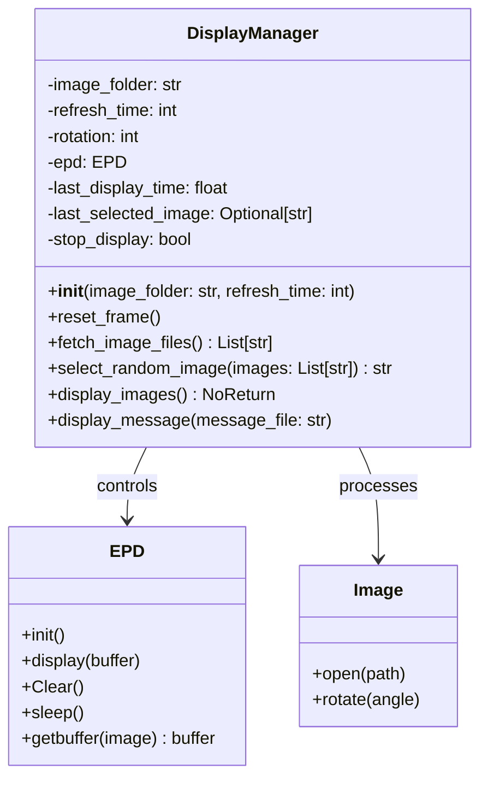
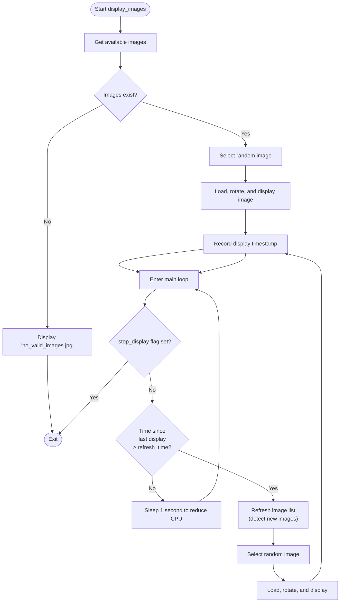

# Display Manager Module

## Table of Contents
1. [Overview](#overview)
2. [Architecture](#architecture)
3. [Class Structure](#class-structure)
4. [Methods](#methods)
5. [Display Rotation Logic](#display-rotation-logic)
6. [Dependencies](#dependencies)
7. [Usage Examples](#usage-examples)

---

## Overview

The `DisplayManager` class is responsible for all aspects of displaying images on a Waveshare 7.3-inch color e-paper display. It handles:

- **E-paper Hardware Control**: Initialization and communication with the Waveshare EPD7in3f display driver
- **Image Rotation**: Continuous rotation of images at configurable intervals
- **Random Selection**: Intelligent random image selection with duplicate prevention
- **Lifecycle Management**: Proper initialization and graceful cleanup on shutdown
- **Message Display**: Support for displaying predefined status message images

The module acts as the display abstraction layer, separating hardware-specific details from the main application logic.

### Key Features
- Automatic image rotation with configurable refresh intervals
- Prevention of consecutive duplicate images when multiple images are available
- Support for image rotation (0°, 90°, 180°, 270°)
- Graceful shutdown and resource cleanup
- Low CPU usage display loop with 1-second polling intervals

---

## Architecture



---

## Class Structure

### Attributes

| Attribute | Type | Description |
|-----------|------|-------------|
| `image_folder` | `str` | Path to directory containing processed images for display |
| `refresh_time` | `int` | Interval in seconds between image rotations |
| `rotation` | `int` | Image rotation angle in degrees (0, 90, 180, 270) |
| `epd` | `EPD` | Waveshare e-paper display driver instance |
| `last_display_time` | `float` | Timestamp of the last image display (used for timing rotation) |
| `last_selected_image` | `Optional[str]` | Name of previously displayed image (prevents consecutive duplicates) |
| `stop_display` | `bool` | Control flag for halting the display loop |

### Initialization

The constructor performs the following:

1. **Configuration Setup**: Initializes timing parameters and state variables
2. **Hardware Initialization**: Creates and initializes the EPD display driver
3. **Cleanup Registration**: Registers `reset_frame()` to be called automatically on program exit via `atexit`

---

## Methods

### `__init__(image_folder: str, refresh_time: int) -> None`

Initializes the display manager with configuration and hardware setup.

**Parameters:**
- `image_folder` (str): Path to directory containing processed images
- `refresh_time` (int): Interval in seconds between image rotations

**Side Effects:**
- Initializes e-paper display hardware
- Registers cleanup handler for graceful shutdown
- Sets initial state variables

**Example:**
```python
from display_manager import DisplayManager

manager = DisplayManager(image_folder="/path/to/images", refresh_time=600)
```

---

### `reset_frame() -> None`

Cleans up display resources and puts the e-paper display into sleep mode.

**Purpose:**
- Called automatically on program exit (registered via `atexit`)
- Clears any displayed content to prevent burn-in
- Puts display into low-power sleep mode to save battery

**Side Effects:**
- Clears the e-paper display
- Powers down the display to sleep mode

**Example:**
```python
# Called automatically, but can be called manually:
manager.reset_frame()
```

---

### `fetch_image_files() -> List[str]`

Retrieves all image files from the configured image directory.

**Returns:**
- List of image filenames available for display

**Note:** This method is called frequently during the display loop to detect newly added images.

**Example:**
```python
images = manager.fetch_image_files()
# images = ['image1.jpg', 'image2.png', 'image3.jpg']
```

---

### `select_random_image(images: List[str]) -> str`

Selects a random image with intelligent duplicate prevention.

**Parameters:**
- `images` (List[str]): List of available image filenames

**Returns:**
- Filename of the selected image

**Logic:**
1. If only one image exists, return that image (no choice available)
2. Create list of candidate images excluding the last displayed image
3. If all images were filtered (shouldn't occur), reset to full list
4. Select and return a random image from candidates

**Purpose:** Prevents user from seeing the same image twice in a row when multiple images are available, improving user experience.

**Example:**
```python
available = ['photo1.jpg', 'photo2.jpg', 'photo3.jpg']
next_image = manager.select_random_image(available)
# Returns one of the images NOT equal to manager.last_selected_image
```

---

### `display_images() -> NoReturn`

Starts the continuous image display rotation loop.

**Returns:**
- Never returns (runs indefinitely with `NoReturn` type hint)

**Control Flow:**



**Key Behaviors:**

- **Initial Display**: Selects and displays a random image immediately
- **Refresh Interval**: Checks elapsed time and rotates to next image when `refresh_time` seconds have passed
- **Dynamic Image List**: Refreshes the image list on each rotation to detect newly added images
- **CPU Efficiency**: Sleeps for 1 second between checks to prevent busy-waiting
- **Error Handling**: Displays a fallback message if no images are found

**Example:**
```python
manager = DisplayManager("/path/to/images", refresh_time=600)
# This will run forever, updating the display every 600 seconds
manager.display_images()
```

---

### `display_message(message_file: str) -> None`

Displays a predefined status message image on the screen.

**Parameters:**
- `message_file` (str): Filename of the message image to display (located in the `messages/` directory)

**Behavior:**
1. Constructs path to message file: `{SCRIPT_DIR}/messages/{message_file}`
2. Loads the image file
3. Applies rotation if configured
4. Displays on e-paper screen

**Error Handling:**
- **FileNotFoundError**: Prints warning if message file doesn't exist
- **General Exceptions**: Catches and prints error details if display fails

**Example:**
```python
# Display startup message
manager.display_message("start.jpg")

# Display error message
manager.display_message("error.jpg")
```

**Common Messages:**
- `start.jpg`: Shown during application startup while images are being processed
- `no_valid_images.jpg`: Shown when no valid images are found in the directory

---

## Display Rotation Logic

### Timing Mechanism

The display rotation uses a simple elapsed-time comparison:

```
current_time = now()
elapsed = current_time - last_display_time

if elapsed >= refresh_time:
    rotate_to_next_image()
    last_display_time = current_time
```

**Characteristics:**
- Non-blocking: Checks happen during the main loop polling
- Drift-tolerant: Works with any polling frequency (uses 1-second intervals)
- Flexible: Allows `refresh_time` to be any integer value in seconds

### Duplicate Prevention Strategy

The system prevents consecutive duplicate images using a simple history mechanism:

1. After displaying an image, store its filename in `last_selected_image`
2. When selecting the next image, exclude `last_selected_image` from candidates
3. Only works when multiple images are available
4. Single-image scenarios always display that image (no choice)

**Edge Case Handling:**
- If only 1 image exists: Always display it (even consecutively)
- If all images are filtered: Reset to full list (shouldn't happen with proper logic)

---

## Dependencies

### External Libraries

| Library | Purpose | Version |
|---------|---------|---------|
| `PIL` (Pillow) | Image loading, rotation, and buffer conversion | Latest |
| `waveshare_epd` | E-paper display driver communication | Bundled in `/lib` |

### System Dependencies

- **Python 3.7+**: Type hints and modern syntax
- **Waveshare 7.3" Color E-Paper Display**: Hardware interface
- **GPIO Access**: For display communication with Raspberry Pi or similar

### Module-Level Configuration

```python
SCRIPT_DIR: str = os.path.dirname(os.path.abspath(__file__))
LIB_PATH: str = os.path.join(SCRIPT_DIR, "lib")
sys.path.append(LIB_PATH)  # Adds lib directory to Python path
```

---

## Usage Examples

### Basic Setup

```python
from display_manager import DisplayManager

# Create display manager
manager = DisplayManager(
    image_folder="/tmp/processed_images",
    refresh_time=600  # Rotate every 10 minutes
)

# Show startup message
manager.display_message("start.jpg")

# Begin continuous display rotation
manager.display_images()  # Runs indefinitely
```

### With Image Processing

```python
from display_manager import DisplayManager
from image_converter import ImageConverter

# Process images
converter = ImageConverter(source_dir="/media/usb/photos", output_dir="/tmp/images")
converter.process_images()

# Display processed images
manager = DisplayManager(image_folder="/tmp/images", refresh_time=300)
manager.display_images()
```

### Graceful Shutdown

```python
import signal

def signal_handler(sig, frame):
    manager.stop_display = True
    manager.reset_frame()
    sys.exit(0)

manager = DisplayManager("/tmp/images", 600)
signal.signal(signal.SIGINT, signal_handler)
manager.display_images()
```

---

## Integration Points

### With `frame_manager.py`

The frame manager uses DisplayManager to show messages during processing:

```python
display_manager = DisplayManager(image_folder=PIC_PATH, refresh_time=refresh_time)
display_manager.display_message("start.jpg")  # Show while processing
image_converter.process_images()
display_manager.display_images()  # Start display rotation
```

### With `sd_monitor.py`

The SD monitor launches frame_manager as a subprocess, which instantiates DisplayManager internally.

---

## Technical Notes

### Display Hardware Details

- **Resolution**: 800×480 pixels
- **Color Support**: 7-color e-paper display
- **Driver**: Waveshare EPD7in3f
- **Interface**: GPIO/SPI (configured in driver)
- **Refresh**: Full screen refresh on each image update

### Image Processing Pipeline

Images must be pre-processed by `ImageConverter` before display:
1. Resized to fit 800×480 with aspect ratio preserved
2. Center-cropped to exact dimensions
3. Enhanced for e-ink visibility (saturation and contrast boosted)

### Performance Characteristics

- **CPU Usage**: Minimal (1-second sleep between checks)
- **Memory Usage**: One image in memory at a time
- **Display Update Time**: 2-5 seconds (typical for e-paper refresh)
- **Battery Impact**: Very low due to e-paper's static display nature

