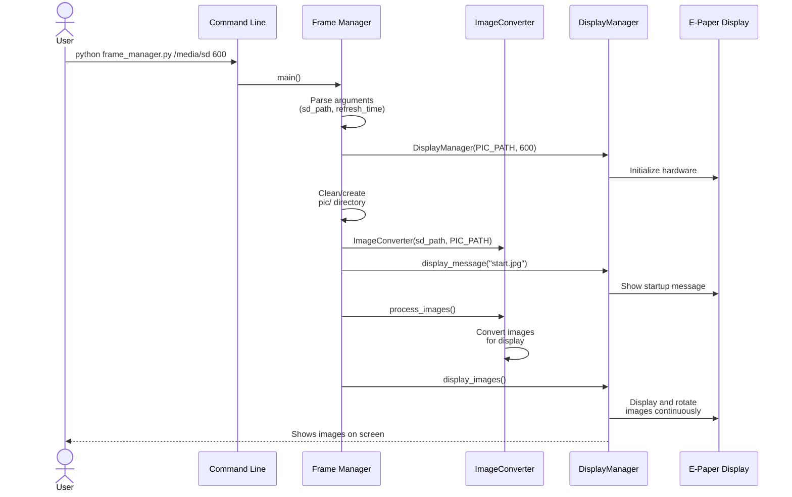
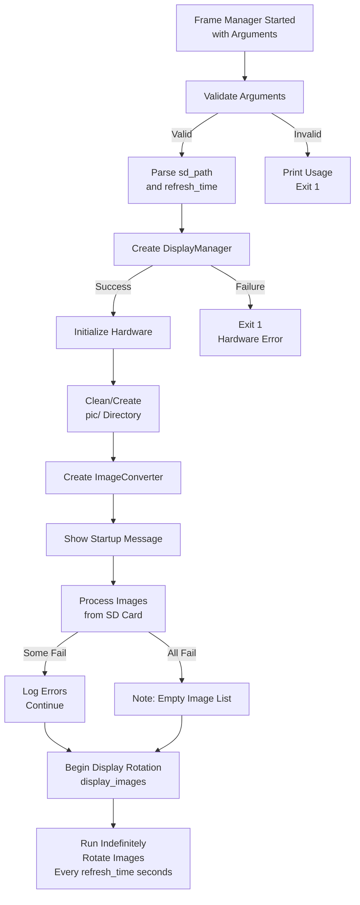

# Frame Manager Module

## Table of Contents
1. [Overview](#overview)
2. [Workflow Architecture](#workflow-architecture)
3. [Command-Line Interface](#command-line-interface)
4. [Main Function](#main-function)
5. [Workflow Steps](#workflow-steps)
6. [Error Handling Strategy](#error-handling-strategy)
7. [Integration Points](#integration-points)
8. [Usage Examples](#usage-examples)

---

## Overview

The `frame_manager.py` module serves as the **main orchestrator** for the complete e-ink frame application workflow. It coordinates between image processing and display management, providing a unified entry point for the entire system.

### Primary Responsibilities

1. **Entry Point**: Main application launcher from command-line or subprocess calls
2. **Pipeline Orchestration**: Coordinates ImageConverter → DisplayManager
3. **Directory Management**: Prepares and cleans the local image cache directory
4. **Message Display**: Shows status messages during various stages
5. **Error Tolerance**: Continues execution even if some images fail to process

### Key Characteristics

- **Subprocess-Friendly**: Designed to be launched as a child process by `sd_monitor.py`
- **Configuration-Driven**: Accepts parameters via command-line arguments
- **Stateless**: Each invocation is independent and complete
- **Graceful Degradation**: Handles errors without crashing unnecessarily

---

## Workflow Architecture



This sequence diagram illustrates the complete workflow from command invocation through continuous image rotation.

---

## Command-Line Interface

### Invocation Syntax

```bash
python frame_manager.py <sd_path> <refresh_time>
```

### Parameters

| Parameter | Type | Description | Example |
|-----------|------|-------------|---------|
| `sd_path` | string | Path to mounted SD card containing source images | `/media/pi/sdcard` |
| `refresh_time` | integer | Time in seconds between image rotations | `600` (10 minutes) |

### Exit Codes

| Code | Meaning |
|------|---------|
| `1` | Insufficient command-line arguments (less than 3 arguments total including script name) |
| `1` | Error during image display operation |
| Infinite | Normal operation (display_images() runs indefinitely) |

### Typical Usage

```bash
# Display images from SD card, rotate every 10 minutes
python3 frame_manager.py /media/pi/sdcard 600

# Display images with 5-minute rotation interval
python3 frame_manager.py /media/pi/photos 300

# Display images with faster 30-second rotation
python3 frame_manager.py /mnt/external_drive 30
```

### Launched from sd_monitor.py

The `sd_monitor.py` module launches frame_manager as a subprocess:

```python
process = subprocess.Popen(
    ["python3", "frame_manager.py", sd_path, str(refresh_time_sec)],
    stdout=sys.stdout,
    stderr=sys.stderr,
    text=True
)
```

---

## Main Function

### Function Signature

```python
def main() -> NoReturn:
    """Main application entry point.

    Orchestrates the complete workflow: image processing from SD card,
    conversion for e-ink display, and continuous image rotation.

    Raises:
        SystemExit: If insufficient command line arguments provided
        Exception: For errors during image processing or display
    """
```

### Detailed Workflow

The `main()` function executes the following steps in order:

---

## Workflow Steps

### 1. Argument Validation

```python
if len(sys.argv) < 3:
    print("Usage: python frame_manager.py <sd_path> <refresh_time>")
    sys.exit(1)
```

**Purpose**: Ensures required parameters are provided

**Failure Mode**: Exits with code 1 if fewer than 3 arguments (script + 2 params)

---

### 2. Argument Parsing

```python
sd_path: str = sys.argv[1]
refresh_time: int = int(sys.argv[2])
```

**Inputs**:
- `sd_path`: Directory path to mounted SD card
- `refresh_time`: Number of seconds between image rotations

**Output**:
- Parsed configuration values ready for module initialization

**Error Handling**: If `refresh_time` cannot be converted to int, a `ValueError` will propagate

---

### 3. DisplayManager Initialization

```python
display_manager: DisplayManager = DisplayManager(
    image_folder=PIC_PATH,
    refresh_time=refresh_time
)
```

**Purpose**:
- Initialize e-paper hardware
- Set up display timing parameters
- Register cleanup handlers

**PIC_PATH**: Local directory `./pic/` where processed images will be stored

**Failure Mode**: Exceptions from hardware initialization will propagate

---

### 4. Directory Preparation

```python
if os.path.exists(PIC_PATH):
    shutil.rmtree(PIC_PATH)  # Remove existing directory tree
os.makedirs(PIC_PATH)  # Create fresh empty directory
```

**Purpose**:
- Clean slate for each invocation
- Removes old processed images
- Creates empty directory ready to receive processed images

**Why This Matters**:
- Ensures old images don't appear from previous runs
- Prevents accumulation of stale images on disk
- Guarantees ImageConverter works with a clean output directory

---

### 5. ImageConverter Initialization

```python
image_converter: ImageConverter = ImageConverter(
    source_dir=sd_path,
    output_dir=PIC_PATH
)
```

**Purpose**:
- Create converter instance with source and destination paths
- Ready to process images on next step

**Configuration**:
- Source: SD card path (user-provided parameter)
- Output: Local `./pic/` directory (just created)

---

### 6. Startup Message Display

```python
display_manager.display_message("start.jpg")
```

**Purpose**:
- Provide visual feedback that application is starting
- Informs user that image processing is beginning
- Occupies display while images are being processed

**File Location**: `./messages/start.jpg` (relative to script directory)

---

### 7. Image Processing

```python
try:
    print("Processing images, please wait...")
    image_converter.process_images()
except Exception as e:
    print(f"Error during image processing: {e}")
    # Continue execution even if some images fail
```

**Purpose**:
- Convert all images from SD card to e-ink optimized format
- Applies resizing, cropping, enhancement

**Error Tolerance**:
- Catches exceptions but continues execution
- Allows display to show whatever images were successfully processed
- Prints error message for debugging

**What ImageConverter Does**:
1. Scans source directory for supported image formats
2. For each image:
   - Correct EXIF orientation
   - Resize while preserving aspect ratio
   - Center-crop to exactly 800×480
   - Enhance saturation and contrast
   - Save to output directory

---

### 8. Begin Display Rotation

```python
try:
    display_manager.display_images()
except Exception as e:
    print(f"Error during image display: {e}")
    sys.exit(1)
```

**Purpose**:
- Start the main display loop
- Continuously rotate through processed images

**Behavior**:
- Runs indefinitely (unless stop_display flag is set)
- Updates display every `refresh_time` seconds
- Selects random images with duplicate prevention

**Error Handling**:
- Catches exceptions from display operations
- Exits with code 1 if display fails
- This exit is critical—display failure means device malfunction

---

## Error Handling Strategy

The frame manager uses a **graceful degradation** approach:

```
Argument Error
    ↓
   [Exit 1]

Display Manager Error
    ↓
   [Propagate, Exit 1]

Image Processing Error
    ↓
   [Log, Continue]
    ↓
Display with processed images (partial success)
```

### Error Scenarios

| Scenario | Handling | Result |
|----------|----------|--------|
| Missing arguments | Validate and exit with code 1 | Clean failure message |
| Invalid refresh_time | ValueError propagates, crashes | Requires correct argument type |
| Hardware init failure | DisplayManager exception, propagates | Requires hardware fix |
| SD card access error | ImageConverter exception caught, logged | Display shows partial results |
| Some images fail to convert | Caught by try-except, application continues | Displays successfully converted images |
| No valid images found | ImageConverter returns, DisplayManager shows fallback | Shows "no_valid_images.jpg" |
| Display hardware failure | DisplayManager exception, exit 1 | Hard stop—hardware issue |

### Rationale for Error Tolerance

The module accepts partial failures during image processing because:

1. **User Experience**: Displaying 10 good images is better than showing nothing due to 1 bad image
2. **Robustness**: SD card may contain corrupted or unsupported image files
3. **Operational Continuity**: Device keeps working even with minor issues
4. **Debugging**: Error messages are printed for troubleshooting

---

## Integration Points

### With ImageConverter

Frame manager creates and controls the ImageConverter instance:

```python
image_converter = ImageConverter(source_dir=sd_path, output_dir=PIC_PATH)
image_converter.process_images()
```

**Contract**:
- Provides source directory path (from user input)
- Expects processed images in output directory
- Tolerates exceptions from converter

---

### With DisplayManager

Frame manager creates DisplayManager and orchestrates its lifecycle:

```python
display_manager = DisplayManager(image_folder=PIC_PATH, refresh_time=refresh_time)
display_manager.display_message("start.jpg")
display_manager.display_images()  # Runs forever
```

**Contract**:
- Passes processed image directory path
- Passes refresh time from user input
- Expects display_images() to run indefinitely
- display_images() should not return (NoReturn type)

---

### With sd_monitor.py

The SD monitor launches frame_manager as a subprocess:

```python
process = subprocess.Popen(
    ["python3", IMAGE_PROCESSING_SCRIPT, sd_path, str(refresh_time_sec)],
    stdout=sys.stdout,
    stderr=sys.stderr,
    text=True
)
```

**Expectations**:
- Frame manager accepts two positional arguments
- Logs output is captured and forwarded
- Process runs indefinitely until termination signal is received
- Handles SIGTERM gracefully (via DisplayManager cleanup)

---

## Usage Examples

### Direct Command-Line Usage

```bash
# Basic usage with 10-minute rotation
python3 frame_manager.py /media/pi/sdcard 600

# Faster rotation (30 seconds)
python3 frame_manager.py /media/pi/photos 30

# Longer interval (30 minutes)
python3 frame_manager.py /mnt/external 1800
```

### When Called from sd_monitor.py

SD monitor handles subprocess launch automatically:

```bash
# User starts SD monitor
python3 sd_monitor.py

# SD monitor detects SD card insertion
# SD monitor reads refresh_time.txt from SD card
# SD monitor automatically launches:
#   python3 frame_manager.py /media/pi/sdcard 600
```

### Testing Image Processing

```bash
# Process images without display (using image converter directly)
python3 frame_manager.py /media/pi/test_images 300

# Check processed images in ./pic/ directory
ls -la pic/
```

### With Custom Directories

```bash
# Use custom output path (modify PIC_PATH in code)
python3 frame_manager.py /media/pi/photos 600

# Use different SD card path
python3 frame_manager.py /mnt/external_drive 600
```

---

## Module Configuration

### Path Constants

```python
SCRIPT_DIR: str = os.path.dirname(os.path.abspath(__file__))
PIC_PATH: str = os.path.join(SCRIPT_DIR, "pic")  # ./pic/
SD_MOUNT_BASE: str = "/media/pi"  # Base for SD mounts
```

### Modifying Configuration

To change default directories:

```python
# For custom image output directory
PIC_PATH = "/tmp/eink_images"

# For different SD mount base (e.g., different username)
SD_MOUNT_BASE = "/media/myusername"
```

---

## Startup Sequence Diagram



---

## Performance Characteristics

### Startup Time
- Argument parsing: <1ms
- DisplayManager init: ~1-2 seconds (hardware init)
- Directory operations: <100ms
- ImageConverter init: <100ms
- Message display: ~5 seconds (e-paper refresh)
- **Total startup**: ~8-12 seconds before image processing begins

### Image Processing Time
- Depends on: number of images and image sizes
- Typical: 1-5 seconds per image
- Example: 20 images = 20-100 seconds

### Display Operation
- CPU usage: <1% (1-second sleep intervals)
- Memory: ~50-100MB (one image loaded at a time)
- Display refresh: ~2-5 seconds per image update

---

## Troubleshooting

### Issue: "Usage: python frame_manager.py <sd_path> <refresh_time>"

**Cause**: Incorrect arguments provided

**Solution**:
```bash
# Correct syntax
python3 frame_manager.py /media/pi/sdcard 600

# Not correct
python3 frame_manager.py 600
python3 frame_manager.py /media/pi/sdcard
```

---

### Issue: No images appear on display

**Possible Causes**:
1. No valid images in SD card directory
2. Image processing failed silently
3. Processed images in wrong format

**Debug Steps**:
```bash
# Check source images
ls -la /media/pi/sdcard/

# Check processed images
ls -la pic/

# Run with debug output
python3 frame_manager.py /media/pi/sdcard 600
```

---

### Issue: Frame manager crashes with hardware error

**Cause**: DisplayManager initialization fails

**Possible Reasons**:
- E-paper display not connected
- GPIO pins incorrect
- Wrong display model specified
- Python library not installed

**Solution**: Check hardware connections and display driver configuration

