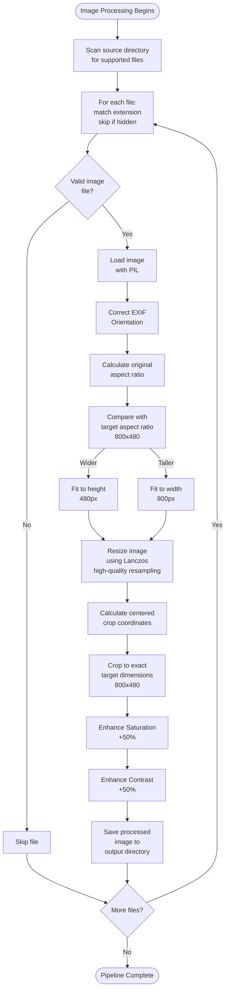

# Image Converter Module

## Table of Contents
1. [Overview](#overview)
2. [Image Processing Pipeline](#image-processing-pipeline)
3. [Class Structure](#class-structure)
4. [Methods](#methods)
5. [Processing Algorithm](#processing-algorithm)
6. [Supported Formats](#supported-formats)
7. [Technical Details](#technical-details)
8. [Usage Examples](#usage-examples)

---

## Overview

The `ImageConverter` class is responsible for transforming raw source images into an optimized format for e-paper display. It handles the complete image processing pipeline, from file discovery through enhancement and output.

### Primary Responsibilities

1. **Image Discovery**: Scans source directory for supported image formats
2. **Format Normalization**: Handles various image formats (JPG, PNG, BMP, GIF, TIFF)
3. **Orientation Correction**: Applies EXIF orientation data to restore proper image alignment
4. **Aspect Ratio Preservation**: Maintains image proportions during resize operations
5. **Centered Cropping**: Intelligently crops images to target dimensions from center
6. **Enhancement**: Boosts saturation and contrast for e-ink visibility
7. **Optimization**: Outputs images in format optimized for e-paper displays

### Key Characteristics

- **Batch Processing**: Processes all images in a directory automatically
- **Error Tolerance**: Skips files that cannot be processed (hidden files, corrupted images)
- **Quality Preservation**: Uses high-quality Lanczos resampling for minimal quality loss
- **E-Ink Optimized**: Specific enhancements tailored for e-paper display characteristics
- **Stateless**: Each image processed independently with no cross-image dependencies

---

## Image Processing Pipeline



This flowchart shows the exact sequence of operations applied to each image.

---

## Class Structure

### Attributes

| Attribute | Type | Description |
|-----------|------|-------------|
| `source_dir` | `str` | Path to directory containing original source images |
| `output_dir` | `str` | Path to directory where processed images will be saved |
| `target_width` | `int` | Target output width: 800 pixels (e-paper display width) |
| `target_height` | `int` | Target output height: 480 pixels (e-paper display height) |

### Target Display Specifications

The converter optimizes for the Waveshare 7.3" color e-paper display:
- **Resolution**: 800×480 pixels
- **Aspect Ratio**: 5:3 (1.667)
- **Color Support**: 7-color e-paper
- **Orientation**: Landscape (800 wide × 480 tall)

---

## Methods

### `__init__(source_dir: str, output_dir: str) -> None`

Initializes the ImageConverter with source and output directory paths.

**Parameters:**
- `source_dir` (str): Path to directory containing source images to process
- `output_dir` (str): Path to directory where processed images will be saved

**Side Effects:**
- Sets source and output directory paths
- Initializes target dimensions (800×480)

**Example:**
```python
from image_converter import ImageConverter

converter = ImageConverter(
    source_dir="/media/pi/sdcard/photos",
    output_dir="/tmp/processed_images"
)
```

**Pre-Conditions:**
- Source directory should exist and contain image files
- Output directory can be created automatically

---

### `process_images() -> None`

Processes all valid image files in the source directory.

**Behavior:**
1. Scans source directory for supported image file extensions
2. Skips hidden files (those starting with `.`)
3. Skips non-image files (wrong extensions)
4. For each valid image file, calls `resize_image()`

**Supported Formats:**
- `.jpg` / `.jpeg` - JPEG images
- `.png` - Portable Network Graphics
- `.bmp` - Bitmap images
- `.gif` - Graphics Interchange Format (animated GIFs processed as single frame)
- `.tiff` - Tagged Image File Format

**File Filtering:**
```python
# These files will be SKIPPED:
.DS_Store          # macOS metadata
.hidden_image.jpg  # Hidden files
document.pdf       # Wrong extension
README.txt         # Non-image file

# These files will be PROCESSED:
photo.jpg
image.png
picture.bmp
animated.gif
scan.tiff
```

**Side Effects:**
- Creates output files in the output directory
- Prints progress messages to stdout for each file

**Error Handling:**
- Silently skips non-image files
- Skips hidden files without notification
- Exceptions from `resize_image()` propagate to caller

**Example:**
```python
converter = ImageConverter("/media/pi/photos", "/tmp/images")
converter.process_images()  # Processes all images in /media/pi/photos

# Output files created in /tmp/images/
# With same filenames as originals
```

---

### `resize_image(img_path: str, file_name: str) -> None`

Resizes, crops, enhances, and saves a single image for e-ink display.

**Parameters:**
- `img_path` (str): Full absolute path to the source image file
- `file_name` (str): Original filename (used for output naming)

**Processing Steps:**

#### 1. Load and Orientation Correction

```python
with Image.open(img_path) as img:
    img = ImageOps.exif_transpose(img)
```

**Purpose**: Reads EXIF metadata to determine if image should be rotated (e.g., photos taken with rotated camera)

**EXIF Orientation Values**:
- Orientation 1: Normal (no rotation)
- Orientation 3: 180° rotation
- Orientation 6: 90° clockwise rotation
- Orientation 8: 270° clockwise (90° counter-clockwise)
- Other orientations: Various flips

---

#### 2. Aspect Ratio Calculation

```python
orig_width, orig_height = img.size
original_aspect_ratio: float = orig_width / orig_height
target_aspect_ratio: float = target_width / target_height  # 800/480 = 1.667
```

**Example Calculations**:
- 1920×1080 image: aspect = 1920/1080 = 1.778 (wider than target)
- 1024×768 image: aspect = 1024/768 = 1.333 (taller than target)
- 800×480 image: aspect = 800/480 = 1.667 (matches target exactly)

---

#### 3. Intelligent Resize Strategy

The converter uses one of two strategies based on aspect ratio comparison:

**Strategy A: Image Wider Than Target** (aspect > 1.667)
```
Original: 1920×1080 (wider)
Target:   800×480

Fit height to 480:
  new_height = 480
  new_width = 480 * (1920/1080) = 853 pixels

Result: 853×480 (slightly wider than 800×480)
→ Will be cropped from sides
```

**Strategy B: Image Taller Than Target** (aspect < 1.667)
```
Original: 1024×768 (taller)
Target:   800×480

Fit width to 800:
  new_width = 800
  new_height = 800 / (1024/768) = 600 pixels

Result: 800×600 (taller than 800×480)
→ Will be cropped from top/bottom
```

**Resampling Algorithm**: Uses PIL's `Image.Resampling.LANCZOS`
- **Lanczos**: High-quality resampling filter
- **Quality**: Best among common algorithms
- **Performance**: Slightly slower than other filters but worth it for image quality
- **Artifacts**: Minimizes halos and color shifts

---

#### 4. Centered Crop Calculation

```python
left:   int = (new_width - target_width) // 2
top:    int = (new_height - target_height) // 2
right:  int = left + target_width
bottom: int = top + target_height
```

**Example: 853×480 image → 800×480 target**
```
new_width = 853, target_width = 800
left = (853 - 800) // 2 = 26
right = 26 + 800 = 826

Crops 26 pixels from left, 26 from right
Result: pixels from x=26 to x=826
```

**Purpose of Center Crop**: Removes equal amounts from opposite edges
- Ensures focal points (faces, objects) remain centered
- Better than left/right or top/bottom cropping for arbitrary images

---

#### 5. Color and Contrast Enhancement

```python
color_enhancer: ImageEnhance.Color = ImageEnhance.Color(cropped_img)
cropped_img = color_enhancer.enhance(1.5)  # 50% more saturation

contrast_enhancer: ImageEnhance.Contrast = ImageEnhance.Contrast(cropped_img)
cropped_img = contrast_enhancer.enhance(1.5)  # 50% more contrast
```

**Saturation Enhancement**:
- **Factor 1.5**: Multiplies color saturation by 1.5
- **Effect**: Colors become more vivid
- **Rationale**: E-ink displays have more muted colors; boost compensates
- **Range**: 0.0 (grayscale) to 2.0+ (very colorful)

**Contrast Enhancement**:
- **Factor 1.5**: Multiplies contrast by 1.5
- **Effect**: Differences between light and dark areas become more pronounced
- **Rationale**: E-ink displays have lower contrast than LCD; boost improves visibility
- **Result**: Text and details become sharper

**Combined Effect**: Images optimized for e-paper's display characteristics

---

#### 6. Save Optimized Image

```python
output_path: str = os.path.join(self.output_dir, file_name)
cropped_img.save(output_path)
```

**Output Format**:
- Same filename and extension as original
- Saved to output directory
- Format determined by file extension

**Quality Considerations**:
- JPEG: Lossy compression (smaller file, slightly lower quality)
- PNG: Lossless compression (larger file, perfect quality)
- Both formats work well for e-paper display

---

## Processing Algorithm

### Detailed Example: 1920×1080 Photo → 800×480

Let's trace a complete image through the pipeline:

**Input**: `/media/pi/photos/vacation.jpg` (1920×1080 pixels)

**Step 1: Load and EXIF Correction**
- Opens image with PIL
- Reads EXIF orientation tag
- If rotated, applies rotation correction

**Step 2: Calculate Aspects**
```
Original aspect ratio = 1920 / 1080 = 1.778
Target aspect ratio   = 800 / 480 = 1.667
Difference: 1.778 > 1.667 (original is wider)
→ Use Strategy A: Fit to height
```

**Step 3: Calculate New Dimensions**
```
target_height = 480
new_height = 480
new_width = 480 * (1920/1080) = 853
```

**Step 4: Resize**
- Original: 1920×1080 → New: 853×480
- Uses Lanczos high-quality resampling

**Step 5: Calculate Crop Coordinates**
```
left   = (853 - 800) // 2 = 26
top    = (480 - 480) // 2 = 0
right  = 26 + 800 = 826
bottom = 0 + 480 = 480

Crop box: (26, 0, 826, 480)
```

**Step 6: Crop Image**
- Removes 26 pixels from left side
- Removes 27 pixels from right side (853 - 826)
- Keeps all vertical pixels

**Step 7: Enhance**
- Saturation: ×1.5 (50% boost)
- Contrast: ×1.5 (50% boost)

**Step 8: Save**
- Output: `/tmp/images/vacation.jpg` (800×480 pixels)
- Ready for display on e-paper

---

## Supported Formats

### Input Image Formats

| Format | Extension | Notes |
|--------|-----------|-------|
| JPEG | `.jpg`, `.jpeg` | Most common format; lossy compression |
| PNG | `.png` | Lossless; supports transparency |
| BMP | `.bmp` | Uncompressed bitmap; large files |
| GIF | `.gif` | Animated GIFs treated as single frame (first frame) |
| TIFF | `.tiff` | High-quality; used in professional photography |

### Output Format

- **Default**: Same as input format
- **Optimization**: Re-encoded through PIL for consistency
- **All formats**: Readable by e-paper display driver

### Format Recommendations

| Use Case | Recommended Format |
|----------|-------------------|
| Photo quality | JPEG (balance of quality and file size) |
| Graphics/artwork | PNG (lossless, supports transparency) |
| Screenshots | PNG (perfect quality) |
| Scanned documents | TIFF (maximum quality) |
| Photographs | JPEG (most efficient) |

---

## Technical Details

### Color Space Handling

- **Input**: Any color space supported by PIL (RGB, RGBA, CMYK, etc.)
- **Processing**: Converted to RGB as needed
- **Output**: RGB for e-paper display (7-color display handles this)

### Transparency Handling

- **PNG with Alpha**: Transparency preserved
- **Effect on E-Paper**: Transparent areas may appear white/background color
- **Best Practice**: Use PNG for graphics, JPEG for photos

### Special Cases

#### Single Color Images
```
Input: 1×1 pixel image (all same color)
→ Scaled to 853×480, then cropped to 800×480
Result: Solid-color 800×480 image
```

#### Very Small Images
```
Input: 100×100 pixel image (tiny)
→ Enlarged to 853×480 (upscaling)
Effect: May appear pixelated/blurry
Best Practice: Provide source images ≥800×480
```

#### Animated GIF
```
Input: Animated GIF (multiple frames)
→ Processed using first frame only
Result: Static image on e-paper
Note: GIFs don't animate on e-paper displays
```

---

## Performance Characteristics

### Processing Time per Image

| Image Size | Time | Bottleneck |
|------------|------|-----------|
| 500×400 | ~0.5s | EXIF read, small resize |
| 2000×1500 | ~1-2s | Resize and enhancement |
| 4000×3000 | ~3-5s | Large resize operations |
| 8000×6000 | ~5-10s | Major downsampling needed |

### Memory Usage

- **Per Image**: ~20-50MB during processing (depends on original size)
- **Peak**: During resize operation (temporary buffer)
- **After Save**: Cleaned up (PIL context manager)

### File Size Impact

| Format | Original | Processed | Note |
|--------|----------|-----------|------|
| JPEG | ~200-500KB | ~100-200KB | Compression efficient |
| PNG | ~1-3MB | ~200-500KB | More reduction |
| BMP | ~2-5MB | ~100-200KB | Significant reduction |

---

## Integration Points

### With frame_manager.py

Frame manager instantiates and uses ImageConverter:

```python
image_converter = ImageConverter(source_dir=sd_path, output_dir=PIC_PATH)
image_converter.process_images()
```

**Contract**:
- Source directory is mounted and readable
- Output directory exists and is writable
- Exceptions propagate but are caught by frame_manager

---

### With DisplayManager

DisplayManager consumes processed images:

```python
# ImageConverter outputs to PIC_PATH
# DisplayManager reads from same PIC_PATH
display_manager = DisplayManager(image_folder=PIC_PATH, refresh_time=600)
```

**Dependency**:
- DisplayManager expects 800×480 images
- Files should be valid image format
- Any image format supported by PIL will work

---

## Usage Examples

### Basic Image Processing

```python
from image_converter import ImageConverter

# Process all images in SD card
converter = ImageConverter(
    source_dir="/media/pi/sdcard",
    output_dir="/tmp/images"
)
converter.process_images()

# Check output
import os
images = os.listdir("/tmp/images")
print(f"Processed {len(images)} images")
```

### In Complete Workflow

```python
from image_converter import ImageConverter
from display_manager import DisplayManager

# Process images
converter = ImageConverter(
    source_dir="/media/pi/photos",
    output_dir="/tmp/processed"
)
converter.process_images()

# Display processed images
manager = DisplayManager(
    image_folder="/tmp/processed",
    refresh_time=300  # 5 minutes
)
manager.display_images()
```

### Error Handling

```python
from image_converter import ImageConverter

converter = ImageConverter("/media/pi/photos", "/tmp/images")

try:
    converter.process_images()
    print("Image processing complete")
except Exception as e:
    print(f"Error during processing: {e}")
    # Check what was successfully processed
    import os
    processed = len(os.listdir("/tmp/images"))
    print(f"{processed} images successfully processed")
```

### Batch Processing Multiple Sets

```python
from image_converter import ImageConverter
import os

# Process multiple SD cards
sd_cards = ["/media/pi/sd1", "/media/pi/sd2", "/media/pi/sd3"]

for sd_path in sd_cards:
    if os.path.exists(sd_path):
        converter = ImageConverter(
            source_dir=sd_path,
            output_dir="/tmp/images"
        )
        converter.process_images()
        print(f"Processed images from {sd_path}")
```

---

## Troubleshooting

### Issue: "No images found, displaying default message"

**Cause**: ImageConverter processed no valid images

**Possible Reasons**:
1. Source directory is empty
2. Image files have unsupported extensions
3. All images failed to process

**Debug**:
```bash
# Check source directory
ls -la /media/pi/sdcard/

# Check for supported extensions
find /media/pi/sdcard -type f \( -name "*.jpg" -o -name "*.png" \)
```

---

### Issue: Processed images look wrong

**Possible Causes**:
1. EXIF orientation applied incorrectly (rotated camera photo)
2. Enhancement settings too aggressive (over-saturated)
3. Aspect ratio mismatch

**Debug**:
```python
# Try processing a single image with debug output
from PIL import Image, ImageOps

img_path = "/media/pi/photo.jpg"
with Image.open(img_path) as img:
    print(f"Original size: {img.size}")
    img = ImageOps.exif_transpose(img)
    print(f"After EXIF correction: {img.size}")
```

---

### Issue: Processing takes very long time

**Cause**: Large images or many images

**Solutions**:
1. Pre-resize images to ~2000×1500 maximum
2. Convert all images to JPEG format (faster than PNG)
3. Reduce number of images on SD card

---

## Enhancement Tuning

To adjust image enhancement, modify the enhancement factors:

```python
# Current values (50% boost each)
color_enhancer.enhance(1.5)      # Saturation
contrast_enhancer.enhance(1.5)   # Contrast

# Less enhancement (more natural looking)
color_enhancer.enhance(1.2)      # 20% saturation boost
contrast_enhancer.enhance(1.2)   # 20% contrast boost

# More enhancement (stronger colors/contrast)
color_enhancer.enhance(1.8)      # 80% saturation boost
contrast_enhancer.enhance(1.8)   # 80% contrast boost
```

**Tuning Guide**:
- **1.0**: No change (original)
- **1.0-1.3**: Subtle, natural enhancement
- **1.3-1.7**: Moderate, recommended for e-ink
- **1.7+**: Aggressive, risk of oversaturation
- **0.5**: Reduce saturation/contrast (grayscale effect)

