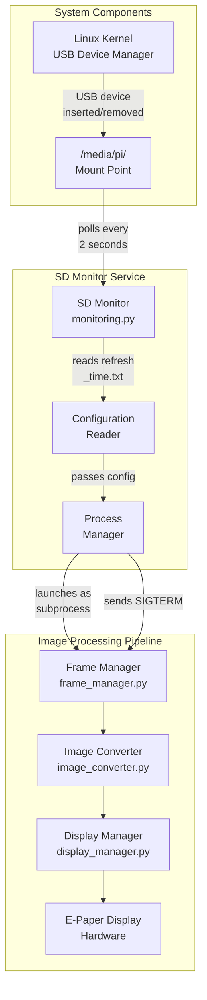
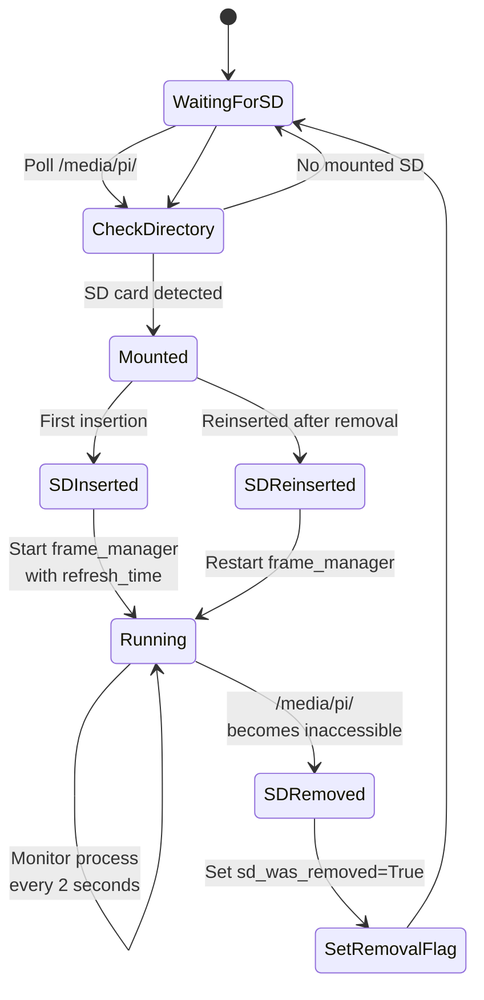

# SD Monitor Module

## Table of Contents
1. [Overview](#overview)
2. [System Architecture](#system-architecture)
3. [State Machine Logic](#state-machine-logic)
4. [Global State Management](#global-state-management)
5. [Function Documentation](#function-documentation)
6. [Configuration File Format](#configuration-file-format)
7. [Signal Handling](#signal-handling)
8. [Error Recovery](#error-recovery)
9. [Usage Examples](#usage-examples)

---

## Overview

The `sd_monitor.py` module is a **system service** that continuously monitors for SD card insertion and removal events, automatically launching and managing the image processing pipeline.

### Primary Responsibilities

1. **SD Card Detection**: Monitors the SD mount directory for new mounts
2. **Process Management**: Launches frame_manager.py as a subprocess
3. **Dynamic Configuration**: Reads refresh time settings from SD card
4. **Automatic Restart**: Handles SD card swaps with graceful restart
5. **Cleanup**: Removes stale mount directories that interfere with detection
6. **Signal Handling**: Properly terminates child processes on shutdown

### Key Characteristics

- **Service-Oriented**: Designed to run continuously as a background service
- **Zero-Configuration**: Automatic detection and startup
- **Stateful**: Tracks SD insertion/removal state to detect transitions
- **Fault-Tolerant**: Handles mount errors and stale directories
- **User-Friendly**: Reads configuration from user's SD card (no code changes needed)

### Typical Deployment

```
Boot Raspberry Pi
↓
Start sd_monitor.py as service/background process
↓
sd_monitor continuously monitors /media/pi/ directory
↓
User inserts SD card
↓
sd_monitor detects mount
↓
sd_monitor reads refresh_time.txt from SD card
↓
sd_monitor launches frame_manager.py with configuration
↓
frame_manager processes images and displays on e-paper
↓
User removes SD card
↓
sd_monitor detects removal
↓
sd_monitor terminates frame_manager process
↓
sd_monitor waits for new SD card
```

---

## System Architecture



This architecture shows how sd_monitor coordinates with the system and orchestrates the image processing pipeline.

---

## State Machine Logic



### State Definitions

| State | Condition | Actions | Next State |
|-------|-----------|---------|-----------|
| **WaitingForSD** | No SD card mounted | Poll directory every 2s | CheckDirectory |
| **CheckDirectory** | Directory scan complete | Analyze mount status | WaitingForSD or Mounted |
| **Mounted** | SD card detected in mount point | Determine if fresh or reinserted | SDInserted or SDReinserted |
| **SDInserted** | First SD card detection | Start frame_manager | Running |
| **SDReinserted** | SD reinserted after removal | Restart frame_manager | Running |
| **Running** | Process is active | Monitor subprocess health | SDRemoved or Running |
| **SDRemoved** | Mount point inaccessible | Set removal flag | WaitingForSD |
| **SetRemovalFlag** | Flag set for restart logic | Reset removal flag after restart | WaitingForSD |

### State Transitions

**Fresh Insertion**:
```
WaitingForSD → Mounted (sd_inserted=False, sd_was_removed=False)
            → SDInserted
            → Running
```

**After Removal and Reinsertion**:
```
Running → SDRemoved (sd_was_removed=True)
       → WaitingForSD
       → Mounted (sd_inserted=False, sd_was_removed=True)
       → SDReinserted
       → Running
```

---

## Global State Management

### Module-Level Variables

```python
process: Optional[subprocess.Popen] = None
sd_was_removed: bool = False
```

### State Variable Purpose

#### `process`

- **Type**: `subprocess.Popen` or `None`
- **Meaning**: Reference to the running frame_manager subprocess
- **Modified By**:
  - `start_frame_manager()`: Creates new process
  - `monitor_sd_card()`: Checks process status
- **Used For**: Terminating old process before starting new one

#### `sd_was_removed`

- **Type**: `bool`
- **Meaning**: Tracks whether SD card was recently removed
- **Purpose**: Triggers restart on reinsertion (avoids repeated starts)
- **Reset**: After successful restart
- **Logic**:
  ```
  If sd_was_removed and SD detected:
    → Restart frame_manager
    → Clear sd_was_removed flag
  ```

### Local Variables in monitor_sd_card()

#### `sd_inserted`

- **Type**: `bool`
- **Scope**: Function-local (reset each call to monitor_sd_card())
- **Meaning**: Current SD insertion state (distinct from global flag)
- **Purpose**: Differentiates "first insertion" from "reinsertion"

### State Diagram Flow

```
Initial: process=None, sd_was_removed=False, sd_inserted=False

[SD card inserted]
  → valid_dirs = ["usb-device"]
  → sd_inserted=False, sd_was_removed=False
  → Condition: not sd_inserted (True)
  → ACTION: Start frame_manager
  → sd_inserted=True

[SD card remains inserted, loop continues]
  → valid_dirs = ["usb-device"]
  → sd_inserted=True, sd_was_removed=False
  → Condition: not sd_inserted (False)
  → No action, continue monitoring

[SD card removed]
  → valid_dirs = []
  → sd_inserted=True
  → Condition: sd_inserted (True)
  → ACTION: sd_inserted=False, sd_was_removed=True

[New SD card inserted (or same one reinserted)]
  → valid_dirs = ["usb-device"]
  → sd_inserted=False, sd_was_removed=True
  → Condition: not sd_inserted or sd_was_removed (True)
  → ACTION: Restart frame_manager
  → sd_inserted=True, sd_was_removed=False
```

---

## Function Documentation

### `get_refresh_time(sd_path: str, filename: str = "refresh_time.txt") -> int`

Reads the display refresh interval configuration from the SD card.

**Parameters:**
- `sd_path` (str): Path to the mounted SD card directory
- `filename` (str, optional): Name of the configuration file (default: `"refresh_time.txt"`)

**Returns:**
- `int`: Refresh time in seconds (defaults to 600 if not found or invalid)

**Configuration File Format:**
```
File: refresh_time.txt
Location: Root of SD card
Content: Single integer representing seconds
Example: 300
```

**Error Handling:**

| Scenario | Handling | Return |
|----------|----------|--------|
| File exists, valid number | Parse and return | Parsed value |
| File exists, invalid format | Log warning | 600 |
| File missing | Log message | 600 |
| Read error | Log exception | 600 |

**Example:**
```python
refresh_time = get_refresh_time("/media/pi/usb-drive")
# Returns 600 or value from refresh_time.txt

# Customize config file name
refresh_time = get_refresh_time("/media/pi/usb-drive", "display_time.txt")
```

**File Content Examples:**

```bash
# Valid configurations
echo "600" > /media/pi/sdcard/refresh_time.txt    # 10 minutes
echo "300" > /media/pi/sdcard/refresh_time.txt    # 5 minutes
echo "30" > /media/pi/sdcard/refresh_time.txt     # 30 seconds
echo "1800" > /media/pi/sdcard/refresh_time.txt   # 30 minutes
```

---

### `start_frame_manager(sd_path: str) -> None`

Launches frame_manager.py as a subprocess with appropriate configuration.

**Parameters:**
- `sd_path` (str): Path to the mounted SD card containing source images

**Behavior:**

1. **Terminate Existing Process** (if running):
   ```python
   if process is not None and process.poll() is None:
       process.send_signal(signal.SIGTERM)
       process.wait()
   ```

2. **Read Configuration**:
   ```python
   refresh_time_sec = get_refresh_time(sd_path)
   ```

3. **Launch New Process**:
   ```python
   process = subprocess.Popen(
       ["python3", IMAGE_PROCESSING_SCRIPT, sd_path, str(refresh_time_sec)],
       stdout=sys.stdout,
       stderr=sys.stderr,
       text=True
   )
   ```

**Process Configuration:**
- **Command**: `python3 frame_manager.py {sd_path} {refresh_time}`
- **Output**: Redirected to parent process stdout/stderr
- **Type**: Text mode (lines are strings, not bytes)

**Example:**
```python
start_frame_manager("/media/pi/usb-drive")
# Reads refresh_time.txt from /media/pi/usb-drive
# Launches: python3 frame_manager.py /media/pi/usb-drive 600
```

**Signal Flow:**

```
start_frame_manager() called
  ↓
Check if existing process (process != None)
  ├─ Yes → Send SIGTERM signal
  │       → Wait for termination
  │       → DisplayManager.reset_frame() executes (registered exit)
  │       → Process terminates cleanly
  ├─ No → Continue
  ↓
Read refresh_time from SD card
  ├─ File found → Parse value
  ├─ File missing → Default to 600
  ├─ Invalid → Default to 600
  ↓
Launch subprocess
  ↓
return to caller
```

**Error Scenarios:**

| Scenario | Behavior |
|----------|----------|
| Old process won't terminate | Wait indefinitely (may hang) |
| refresh_time.txt invalid | Default to 600, continue |
| SD card path doesn't exist | frame_manager receives bad path (handles error) |
| frame_manager fails to start | Exception propagates |

---

### `monitor_sd_card() -> None`

Continuously monitors for SD card insertion/removal events.

**Polling Loop:**
- Interval: 2 seconds
- Condition: Infinite loop (`while True`)
- Sleep: `time.sleep(2)` at end of each iteration

**Per-Iteration Logic:**

```python
try:
    # 1. Scan for mounted directories
    items = os.listdir(SD_MOUNT_BASE)  # e.g., [".keep", "usb-drive"]

    # 2. Filter to valid directories only
    valid_dirs = [item for item in items if os.path.isdir(...)]

    # 3. Determine SD status
    if valid_dirs:
        # SD card mounted
        sd_path = os.path.join(SD_MOUNT_BASE, valid_dirs[0])

        if not sd_inserted or sd_was_removed:
            # First insertion or reinsertion
            start_frame_manager(sd_path)
            sd_inserted = True
            sd_was_removed = False
    else:
        # SD card not mounted
        if sd_inserted:
            sd_inserted = False
            sd_was_removed = True  # Flag for restart on reinsertion

except Exception as e:
    print(f"Error monitoring SD card: {e}")

time.sleep(2)  # Wait before next poll
```

**Detection Logic:**

| Condition | Action | Result |
|-----------|--------|--------|
| SD found, `sd_inserted=False` | Start frame_manager | Begin image processing |
| SD found, `sd_inserted=True`, `sd_was_removed=False` | None | Continue monitoring |
| SD found, `sd_inserted=True`, `sd_was_removed=True` | Restart frame_manager | Restart after swap |
| SD missing, `sd_inserted=True` | Set `sd_was_removed=True` | Flag for restart |
| SD missing, `sd_inserted=False` | None | Continue waiting |

**Example Timeline:**

```
t=0s:   Monitor starts, valid_dirs=[], sd_inserted=False
t=2s:   Poll, valid_dirs=[], sd_inserted=False → No action
t=4s:   Poll, valid_dirs=[], sd_inserted=False → No action
t=6s:   [User inserts SD]
t=8s:   Poll, valid_dirs=["usb1"], sd_inserted=False
        → not sd_inserted = True
        → START frame_manager
        → sd_inserted=True
t=10s:  Poll, valid_dirs=["usb1"], sd_inserted=True, sd_was_removed=False
        → Condition False, no action
t=12s:  Poll, valid_dirs=["usb1"], sd_inserted=True, sd_was_removed=False
        → Condition False, no action
t=14s:  [User removes SD]
t=16s:  Poll, valid_dirs=[], sd_inserted=True
        → if sd_inserted: True
        → sd_inserted=False, sd_was_removed=True
t=18s:  Poll, valid_dirs=[], sd_inserted=False
        → No action (waiting for reinsertion)
t=20s:  [User inserts different SD]
t=22s:  Poll, valid_dirs=["usb2"], sd_inserted=False, sd_was_removed=True
        → not sd_inserted or sd_was_removed = True
        → RESTART frame_manager (with new SD path)
        → sd_inserted=True, sd_was_removed=False
```

---

### `cleanup_stale_mounts() -> None`

Removes inaccessible mount directories that may interfere with SD detection.

**Purpose:**

Sometimes when an SD card is improperly removed, the mount directory remains but becomes inaccessible. This function cleans up these "phantom" mounts.

**Algorithm:**

```python
for folder in os.listdir(SD_MOUNT_BASE):
    full_path = os.path.join(SD_MOUNT_BASE, folder)

    # Check if it's a directory
    if not os.path.isdir(full_path):
        continue

    # Test readability and executability
    if not os.access(full_path, os.R_OK | os.X_OK):
        # Inaccessible mount - attempt removal
        try:
            subprocess.run(["sudo", "rm", "-r", full_path], check=True)
        except Exception as e:
            print(f"Failed to remove: {e}")
```

**Scenarios Cleaned:**

1. **Partially Removed Mount**: Directory exists but mount no longer valid
2. **Permission Issues**: Mount became inaccessible due to permissions
3. **Stale References**: Leftover from crashed/unmounted drive
4. **USB Device Errors**: Bad USB connection left mount trace

**Example:**

```bash
# Before cleanup
/media/pi/
  └── usb-dead/    (inaccessible - mount removed)
  └── usb-live/    (accessible - mounted SD)

# After cleanup
/media/pi/
  └── usb-live/
```

**Permissions:**
- **Requires**: `sudo` access (uses `sudo rm` command)
- **Alternative**: Run sd_monitor with elevated privileges

**Error Handling:**
- Catches and logs failures (doesn't halt execution)
- Allows partial cleanup (removes what it can)
- Continues with SD monitoring even if cleanup fails

---

### `main() -> None`

Entry point for the SD card monitoring service.

**Execution Sequence:**

```python
print("Starting SD card monitor...")
cleanup_stale_mounts()    # Clean up phantom mounts
monitor_sd_card()          # Begin infinite monitoring loop
```

**Usage:**
```bash
python3 sd_monitor.py
```

**As System Service:**
```bash
# systemd service file example
[Unit]
Description=E-Ink Frame SD Card Monitor
After=network.target

[Service]
Type=simple
User=pi
ExecStart=/usr/bin/python3 /home/pi/eInkFrame/sd_monitor.py
Restart=always
StandardOutput=journal

[Install]
WantedBy=multi-user.target
```

---

## Configuration File Format

### refresh_time.txt

**Location**: Root of SD card

**Format**: Single integer (positive number)

**Purpose**: Controls image rotation interval in frame_manager

**Examples:**

```txt
# 10 minute rotation (default)
600

# 5 minute rotation
300

# 30 second rotation (for testing)
30

# 30 minute rotation
1800

# 1 hour rotation
3600
```

**Valid Range**: Any positive integer (no maximum enforced)

**Invalid Examples** (use default 600):
```txt
not_a_number
600.5
-600
600 seconds
```

**Discovery Process:**

1. Monitor reads mount point: `/media/pi/usb-drive/`
2. Constructs path: `/media/pi/usb-drive/refresh_time.txt`
3. Attempts file open and read
4. Parses first line as integer
5. Falls back to 600 if invalid or missing

---

## Signal Handling

### Subprocess Termination

When SD card is removed, sd_monitor gracefully terminates frame_manager:

```python
process.send_signal(signal.SIGTERM)  # Send termination signal
process.wait()                        # Wait for process to exit
```

**Signal Flow:**

```
sd_monitor.py
  ├─ Detects SD removal
  └─ Calls start_frame_manager() to restart
      └─ Sends SIGTERM to existing frame_manager
          └─ frame_manager subprocess receives SIGTERM
              └─ Python signal handler invokes cleanup
              └─ DisplayManager.reset_frame() called (via atexit)
                  └─ epd.Clear() - clear display
                  └─ epd.sleep() - put display to sleep
              └─ Process exits cleanly
          └─ sd_monitor continues
```

### DisplayManager Cleanup

DisplayManager registers automatic cleanup:

```python
atexit.register(self.reset_frame)
```

**Cleanup Operations:**
- Clears e-paper display
- Powers down display to sleep mode
- Prevents display burn-in
- Executed automatically on any exit

### Process Status Checking

```python
if process is not None and process.poll() is None:
    # process.poll() returns None if process still running
    # process.poll() returns exit code if process terminated
```

---

## Error Recovery

### Mount Point Scenarios

#### Scenario 1: Normal SD Card Insertion

```
1. User inserts SD card
2. Linux automatically mounts to /media/pi/sdcard/
3. sd_monitor detects directory in listdir()
4. os.path.isdir() confirms it's a directory
5. os.access() confirms readability
6. frame_manager launches with that path
7. Image processing begins
```

**Recovery**: None needed, normal operation

---

#### Scenario 2: SD Card Removal While Running

```
1. SD card mounted, frame_manager running
2. User removes SD card
3. Linux unmounts /media/pi/sdcard/
4. Directory may remain but becomes inaccessible
5. sd_monitor detects missing directory (listdir returns empty)
6. Sets sd_was_removed=True
7. Next poll detects reinsertion with flag set
8. Restarts frame_manager with new configuration
```

**Recovery**: Automatic restart on reinsertion

---

#### Scenario 3: Stale Mount Point

```
1. Bad USB connection or improper removal
2. Mount directory remains but is inaccessible
3. next boot, sd_monitor runs cleanup_stale_mounts()
4. Detects inaccessible directory
5. Removes phantom mount with 'sudo rm -r'
6. Fresh monitoring can now detect real mounts
```

**Recovery**: Automatic cleanup on startup

---

#### Scenario 4: Multiple SD Cards

```
1. SD card #1 mounted at /media/pi/usb1/
2. User plugs in SD card #2
3. Linux mounts to /media/pi/usb2/
4. listdir() returns ['usb1', 'usb2']
5. Code uses first valid directory (usb1)
6. frame_manager continues using original SD
7. New SD card is ignored
```

**Note**: System uses first available mount, doesn't support simultaneous multiple cards

---

### Exception Handling

```python
try:
    # Monitoring logic
    items = os.listdir(SD_MOUNT_BASE)
    # ... rest of monitoring
except Exception as e:
    print(f"Error monitoring SD card: {e}")
    # Loop continues, next iteration tries again
```

**Errors Caught:**
- Permission denied (can't read mount base)
- Mount point removed unexpectedly
- SD card ejected during read
- Other OS-level errors

**Error Response:**
- Logs error message
- Continues monitoring loop
- Retries after 2-second sleep
- No fatal crash

---

## Usage Examples

### Starting the Monitor

```bash
# Start monitoring (foreground)
python3 sd_monitor.py

# Start in background
python3 sd_monitor.py &

# Start with output logging
python3 sd_monitor.py > sd_monitor.log 2>&1 &
```

### As System Service (systemd)

```bash
# Create service file
sudo nano /etc/systemd/system/eink-monitor.service
```

```ini
[Unit]
Description=E-Ink Frame SD Card Monitor
After=network.target

[Service]
Type=simple
User=pi
WorkingDirectory=/home/pi/eInkFrame
ExecStart=/usr/bin/python3 /home/pi/eInkFrame/sd_monitor.py
Restart=always
RestartSec=10
StandardOutput=journal
StandardError=journal

[Install]
WantedBy=multi-user.target
```

```bash
# Enable and start service
sudo systemctl daemon-reload
sudo systemctl enable eink-monitor
sudo systemctl start eink-monitor

# Check status
sudo systemctl status eink-monitor

# View logs
sudo journalctl -u eink-monitor -f
```

### With Custom Refresh Times

#### Create refresh_time.txt on SD card

```bash
# Mount SD card (if not auto-mounted)
sudo mount /dev/sda1 /media/pi/sdcard

# Create config file with 5-minute rotation
echo "300" > /media/pi/sdcard/refresh_time.txt

# Verify
cat /media/pi/sdcard/refresh_time.txt
# Output: 300

# Unmount
sudo umount /media/pi/sdcard
```

#### Insert SD card

```bash
# SD monitor automatically:
# 1. Detects SD card
# 2. Reads refresh_time.txt (300)
# 3. Launches frame_manager with 300-second interval
# 4. Images rotate every 5 minutes
```

### Monitoring from Logs

```bash
# Real-time logs (if using systemd)
sudo journalctl -u eink-monitor -f

# Log output from direct run
python3 sd_monitor.py | tee monitor.log
```

**Expected Output:**
```
Starting SD card monitor...
SD card inserted. Starting frame_manager...
Frame manager started successfully
Using refresh time from refresh_time.txt: 600 seconds
Processing images, please wait...
Displaying initial image: photo1.jpg
Displaying new image: photo2.jpg
```

---

## Integration with System Startup

### Raspberry Pi Boot Sequence

```
1. Raspberry Pi boots
2. Linux kernel loads
3. USB/SD automounting enabled
4. systemd starts user services
5. eink-monitor service starts (if enabled)
6. sd_monitor.py cleanup_stale_mounts() runs
7. sd_monitor.py monitor_sd_card() begins
8. Waits for SD card insertion
```

### Cron Alternative (if not using systemd)

```bash
# Add to crontab (runs on reboot)
@reboot python3 /home/pi/eInkFrame/sd_monitor.py > /tmp/eink.log 2>&1 &
```

---

## Troubleshooting

### Issue: "Error monitoring SD card: Permission denied"

**Cause**: Lack of read permissions on mount base

**Solutions**:
1. Run with `sudo`: `sudo python3 sd_monitor.py`
2. Check mount base permissions: `ls -ld /media/pi/`
3. Fix permissions: `sudo chmod 755 /media/pi/`

---

### Issue: SD card not detected

**Possible Causes**:
1. SD card didn't mount (check `mount` command)
2. Mount path different than `/media/pi/`
3. SD card mounting disabled

**Debug**:
```bash
# Check actual mount location
mount | grep sd

# List mount base
ls -la /media/

# Manually mount SD card
sudo mount /dev/sda1 /media/pi/sdcard

# Run monitor with debugging
python3 -c "import os; print(os.listdir('/media/pi/'))"
```

---

### Issue: frame_manager keeps restarting

**Cause**: Likely SD card in/out cycling or stale mount

**Solution**:
```bash
# Cleanly unmount SD card
sudo umount /media/pi/*

# Remove stale mounts
sudo rm -rf /media/pi/sdcard

# Restart monitor
python3 sd_monitor.py
```

---

### Issue: Permission denied when removing stale mounts

**Cause**: cleanup_stale_mounts() requires sudo

**Solutions**:
1. Run with sudo: `sudo python3 sd_monitor.py`
2. Add to sudoers (allow rm without password):
   ```bash
   sudo visudo
   # Add: pi ALL=(ALL) NOPASSWD: /bin/rm
   ```

---

## System Requirements

| Component | Requirement |
|-----------|-------------|
| Python Version | 3.7+ |
| OS | Linux (Raspberry Pi OS recommended) |
| USB/SD Support | Linux kernel with automounting |
| Permissions | Run as regular user (or with sudo) |
| Display Hardware | E-paper display initialized by frame_manager |

---

## Performance Characteristics

| Metric | Value |
|--------|-------|
| Polling Interval | 2 seconds |
| CPU Usage | <1% (mostly sleeping) |
| Memory Usage | ~10MB (idle) |
| Response Time to SD insertion | 2-4 seconds |
| Response Time to SD removal | 2-4 seconds |

